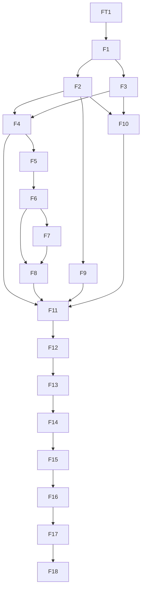

# Swift Institute CI/CD completion review and Swift-native prospective programme

**Commission:** E1 independent adversarial review  
**Reviewer:** OpenAI GPT-5.6 Pro  
**Venue:** ChatGPT/Codex cloud execution session  
**Authenticated read identity:** coenttb (user 22656652)  
**Review completed:** 2026-08-05T20:00:38Z  
**Mode:** read-only; no repository, issue, pull request, ref, ruleset, workflow, dispatch or receipt mutation  
**Edition:** one final post-closure/reopened-Goal iteration. Sections 1–6 appear first and stand alone as Judgment A; Sections 7–23 are the separate prospective Judgment B.

# 1. Current completion verdict

## REJECTED — R1 BLOCKED

Goal [swift-institute/.github#276](https://github.com/swift-institute/.github/issues/276) is currently **open/reopened**. The earlier Claude/Fable 5 acceptance at comment 5195475128, the historical R1 act, and receipt commit `f22d79d83f44d47421bc6a9f452ba24f6a6de96a` are expressly superseded by [reopen comment 5196350083](https://github.com/swift-institute/.github/issues/276#issuecomment-5196350083). They are chronology, not current §6.3 completion proof.

Seven closure blockers remain: A-01 through A-06 and A-09. A-07 is required evidence still UNMEASURED; A-08 is a documentation/evidence correction. Remediation is executing concurrently. This edition marks **none** of the §2 remediation items verified, resolved, closed or terminal: observed artifacts and partner attestations remain obligations until both reviewers reread one frozen cut.

The programme is ineligible for R1 re-finalization now. No cleanup, settings write, dispatch or reclosure is authorized by this review.

| Finding | Classification | Current defect | Disposition | Verification state |
| --- | --- | --- | --- | --- |
| A-01 | CLOSURE BLOCKER | VAL-47/S30 stale-object classification and cleanup has not reached an accepted terminal proof | REMEDIATION IN FLIGHT — JOINT VERIFICATION REQUIRED | OPEN OBLIGATION — NOT VERIFIED IN THIS EDITION |
| A-02 | CLOSURE BLOCKER | R34 now types the reduced G1 contract, but its evidence and recut promotions remain jointly unaccepted | R34 ARTIFACT OBSERVED — JOINT REREAD AND RECUT ACCEPTANCE REQUIRED | OPEN OBLIGATION — NOT VERIFIED IN THIS EDITION |
| A-03 | CLOSURE BLOCKER | R33's platform-refused private-ruleset limb and compensating control require joint verification | ORIGINAL ROLLBACK PRESCRIPTION WITHDRAWN — R33 JOINT REVIEW REQUIRED | OPEN OBLIGATION — NOT VERIFIED IN THIS EDITION |
| A-04 | CLOSURE BLOCKER | R35 now types P19 identity losses, but its §8.13 disposition remains jointly unaccepted | R35 DISPOSITION OBSERVED — §8.13 JOINT ACCEPTANCE REQUIRED | OPEN OBLIGATION — NOT VERIFIED IN THIS EDITION |
| A-05 | CLOSURE BLOCKER | The §13.3 two-mode validator replacement is observed but not functionally or jointly accepted | REPLACEMENT AND TEST FILE OBSERVED — FUNCTIONAL/NEGATIVE-CONTROL/JOINT VERIFICATION REQUIRED | OPEN OBLIGATION — NOT VERIFIED IN THIS EDITION |
| A-06 | CLOSURE BLOCKER | TX11 Skill replacement is observed but correspondence and bilateral acceptance remain open | TX11 REPLACEMENT OBSERVED — CORRESPONDENCE AND JOINT ACCEPTANCE REQUIRED | OPEN OBLIGATION — NOT VERIFIED IN THIS EDITION |
| A-09 | CLOSURE BLOCKER | TX12 violated §8.15/VAL-45 before destructive deletion; R32 remediation is not yet jointly accepted | HISTORICAL VIOLATION ESTABLISHED; REMEDIATION ARTIFACT OBSERVED — JOINT ACCEPTANCE REQUIRED | OPEN OBLIGATION — NOT VERIFIED IN THIS EDITION |
| A-07 | UNMEASURED | The terminal fleet root is not portable or reconstructible per repository | OPEN EVIDENCE OBLIGATION | OPEN OBLIGATION — NOT VERIFIED IN THIS EDITION |
| A-08 | DOCUMENTATION OR EVIDENCE CORRECTION | The new ledger/remediation chronology is observed, but the final report and receipt still require a jointly accepted recut | CURRENT LEDGER OBSERVED — FINAL REPORT/RECEIPT/JOINED ACCEPTANCE RECUT REQUIRED | OPEN OBLIGATION — NOT VERIFIED IN THIS EDITION |

# 2. Reviewed heads and current post-freeze state

## 2.1 Independently reproduced frozen execution cut

| Role | Repository | Full revision | Evidence boundary |
| --- | --- | --- | --- |
| implementation | swift-institute/.github | 1705d2aa89949a84c933359e14e6189fbde3e887 | INDEPENDENTLY REPRODUCED BY GPT AT FROZEN CUT |
| evidence | swift-institute/.github | e6ab5ec5b176729126247f836b20cb26cfdbbdd9 | INDEPENDENTLY REPRODUCED BY GPT AT FROZEN CUT |
| primitiveWrapper | swift-primitives/.github | ea9c55330d496f0b276f9c9a9030c15ce1f07122 | INDEPENDENTLY REPRODUCED BY GPT AT FROZEN CUT |
| standardsWrapper | swift-standards/.github | 904ddb4c5e67be436a772332eef1b16acfbe1765 | INDEPENDENTLY REPRODUCED BY GPT AT FROZEN CUT |
| foundationsWrapper | swift-foundations/.github | 84ac0109aab50db70c46fdba11729a58126f530c | INDEPENDENTLY REPRODUCED BY GPT AT FROZEN CUT |
| workspace | swift-institute/Workspace | 49fad76bed2cc34da62de1b733600e725b6ae2e1 | INDEPENDENTLY REPRODUCED BY GPT AT FROZEN CUT |
| skills | swift-institute/Skills | a4c752911015e8c7ea1cd5fe6f3f8e586e9f55c4 | INDEPENDENTLY REPRODUCED BY GPT AT FROZEN CUT |

The implementation→evidence compare remains one commit whose nine changed paths are confined to `review-inputs/`. The frozen `checksums.sha256` entries independently matched. These facts identify the executioner's declared cut; they do not prove its completion claims.

## 2.2 Current/post-freeze observations

| Coordinate | Observed or attributed fact | Provenance / status |
| --- | --- | --- |
| Goal #276 / 63-comment root / reopen 5196350083 | OPEN — REOPENED at updated_at 2026-08-05T19:50:20Z; earlier acceptance and f22 receipt superseded | INDEPENDENTLY REPRODUCED BY GPT |
| #349 / run 31027146280 / 3297291d77765bb2d1b638c3cc331c7c84bc414d | success, but envelope omits lint and has inventoryDigest=unmeasured | INDEPENDENTLY REPRODUCED BY GPT |
| PR #352 / 9c69d197507f034fe23e01ef5371b2a99d93b4c3 / R32 5195353007 | 13 reconstructed JSON files plus SHA256SUMS observed; R32 deviation remains unaccepted | ARTIFACT OBSERVED BY GPT; REMEDIATION JOINT REVIEW PENDING |
| R33 / comment 5195355040 | ruling exists; partner reports Free-plan 403 absence controls and compensation | RULING OBSERVED BY GPT; UNDERLYING READS ATTRIBUTED TO CLAUDE/FABLE 5 |
| PR #353 / b8fb8b6a1e16448d4133ee939b785ecf6fa24291 | historical intermediate ledger; superseded by PR #355 | INDEPENDENTLY REPRODUCED BY GPT |
| PR #354 / f22d79d83f44d47421bc6a9f452ba24f6a6de96a | historical receipt/ad-hoc validator; superseded | INDEPENDENTLY REPRODUCED BY GPT |
| three stale PR/ref candidates at 19:34Z | all three then observed closed and refs absent during concurrent remediation | INTERMEDIATE GPT OBSERVATION; TERMINAL A-01 PROOF NOT CLAIMED |
| R34 / comment 5196481712 | types reduced G1 lint/inventory contract and MET-under-R34 wording | RULING OBSERVED BY GPT; JOINT ACCEPTANCE PENDING |
| R35 / comment 5196482169 | types P19 identity losses/zero-mandatory and MET-under-R35 wording | RULING OBSERVED BY GPT; JOINT ACCEPTANCE PENDING |
| PR #355 / 2398ef8dd555428941f23d77474de1b9f1181d0d | new validator/tests, stale cleanup evidence and predicate ledger observed | REMEDIATION ARTIFACT OBSERVED; FUNCTIONAL/NEGATIVE/JOINED ACCEPTANCE PENDING |
| Skills #35 / b2ac6552ab6fbe3b4dc0344750f8d8ebd4086247 | CI/CD Skill replacement observed | REPLACEMENT OBSERVED; CORRESPONDENCE/STALE-NEGATIVE/JOINED ACCEPTANCE PENDING |
| Goal comment 5196608562 | executioner says remediation performed and verification belongs to parallel reviewer/principal | EXECUTIONER/PARTNER DECLARATION ONLY — NOT PROOF |

The stale-object state changed during this final read window. That race is recorded rather than laundered into a terminal result: A-01 needs a new frozen, positive-controlled dataset and bilateral acceptance.

# 3. Evidence boundary and method

This review uses four provenance classes:

1. **INDEPENDENTLY REPRODUCED BY GPT AT FROZEN CUT** — source bytes, checksums, compare, frozen predicates and committed defects read independently.
2. **E1-PARTNER ATTESTED POST-FREEZE** — Claude/Fable 5's authenticated private-ruleset 403s, approximately 168-private population, 15-org sample, five fully paginated runs and App-permission cross-check. These are attributed and await the joint reread where this reviewer lacked the endpoint.
3. **USER-SUPPLIED STANDING PRINCIPAL RULING** — main-only/no-tags/no-releases; Nest.Name and “Institute CI”; Application pattern; governance-as-data; Linux/macOS/Windows.
4. **JOINT VERIFICATION PENDING** — every remediation/disposition in the cross-review pack and later live cut, including R32, R33, R34, R35, PR #355 and Skills #35 acceptance.

The executioner's report is not proof of its own claims, and one reviewer's report is not proof of the other's. A sample can narrow an unknown sample limb; it cannot promote an aggregate fleet predicate. Missing required evidence is never treated as clean.

# 4. Completion-authority conformance

| ID | Requirement | Current status | Independent/attributed basis | Finding |
| --- | --- | --- | --- | --- |
| C-01 | Frozen authority identity and supplied checksums | MET | Frozen programme bytes/digests and e6ab5ec5 checksums independently reproduced. |  |
| C-02 | Frozen implementation/evidence separation | MET | 1705d2aa89949a84c933359e14e6189fbde3e887 to e6ab5ec5b176729126247f836b20cb26cfdbbdd9 is the review-inputs-only delta. |  |
| C-03 | Current Goal closure state | NOT_MET | Goal #276 independently read OPEN/REOPENED through the 63-comment root; prior acceptance/receipt superseded. | A-01;A-02;A-03;A-04;A-05;A-06;A-09 |
| C-04 | VAL-47 stale-object terminal root | NOT_MET | Concurrent cleanup was observed, but complete classification, positive-controlled zero and bilateral acceptance are absent. | A-01 |
| C-05 | V1 portable fleet root | UNMEASURED | Aggregate-only evidence; partner 15-org sample is PARTIAL and not portable fleet proof. | A-07 |
| C-06 | P10 / TX12 §8.15 / VAL-45 | NOT_MET | Historical violation established; 9c69 reconstruction and R32 remain joint-review obligations. | A-09 |
| C-07 | P12 private operations | NOT_MET | Reduced G1 omits lint; R34 5196481712 and MET-under-R34 promotion are observed but not jointly accepted. | A-02 |
| C-08 | P13 effective-inventory binding | NOT_MET | G1 records inventoryDigest unmeasured; R34 and MET-under-R34 promotion are observed but not jointly accepted. | A-02 |
| C-09 | P14 private-ruleset limb | NOT_MET | R33 exists; platform-refusal evidence and compensation remain jointly unaccepted. | A-03 |
| C-10 | P15/P17 public caller/ruleset sample | PARTIAL | Claude/Fable 5 attests 15/15 lawful callers and exact ci / matrix / ci-ok rulesets; no portable fleet root. | A-07 |
| C-11 | P19 runtime identity terminality | NOT_MET | R35 5196482169 types empty/null identity families and zero-mandatory; MET-under-R35 promotion remains jointly unaccepted. | A-04 |
| C-12 | Complete run/job pagination | PARTIAL | Five cited runs partner-attested with complete pagination; fleet-level proof absent. | A-07 |
| C-13 | App permission TSV | PARTIAL | Partner-attested cross-check; not promoted to aggregate evidence. | A-07 |
| C-14 | P23 stale-object closure | NOT_MET | Terminal accepted VAL-47 root absent. | A-01 |
| C-15 | P26 Skills synchronization | NOT_MET | Skills replacement b2ac6552ab6fbe3b4dc0344750f8d8ebd4086247 observed; correspondence/negative proof and bilateral acceptance pending. | A-06 |
| C-16 | §13.3 completion+runtime validator | NOT_MET | Replacement and dedicated test observed at 2398ef8dd555428941f23d77474de1b9f1181d0d; functional/rejecting/pre-post and bilateral proof pending. | A-05 |
| C-17 | R34 reduced-contract ruling | NOT_MET | R34 exists; exact evidence, follow-up ownership and MET-under-R34 ledger/receipt acceptance remain jointly pending. | A-02 |
| C-18 | Current ledger/receipt truth | NOT_MET | 2398 ledger observed; promotions remain unaccepted and no fresh final report/receipt exists. | A-08 |
| C-19 | Current bilateral acceptance | NOT_MET | Claude acceptance 5195475128 is superseded; no two current acceptances exist for the 2398/Skills/R34/R35 cut. | A-08 |
| C-20 | Final §6.3 readiness | NOT_MET | Seven closure blockers remain open obligations. | A-01;A-02;A-03;A-04;A-05;A-06;A-09 |

The historical TX12 defect is affirmative, not merely an absent packet item: §8.15 required the merged/read-back evidence tree before destructive deletion and disallowed the only forms then available. The post-freeze reconstruction does not erase that history; R32 must lawfully type its disposition and receive two current acceptances.

Likewise, R33 changes A-03's remedy, not its present gate. This review withdraws the impossible rollback/reapply prescription and requires reconstruction of the measured platform refusal and compensation before accepting the descope.

# 5. Findings and exact reclosure conditions

## A-01 — CLOSURE BLOCKER: VAL-47/S30 stale-object classification and cleanup has not reached an accepted terminal proof

**Authority:** CI-CD-COMPLETION-PROGRAMME §8.7; VAL-46; VAL-47; stop S30  
**Evidence:** At the frozen cut, three exact-prefix bot-authored PR/ref candidates were independently open/live.; During this final read window all three PRs were observed closed and their exact refs absent, showing concurrent remediation.; PR #355 / 2398ef8dd555428941f23d77474de1b9f1181d0d adds seven stale-object-cleanup evidence files and promotes P1/P23, but that dataset and classification have not received bilateral acceptance.; No complete positive-controlled terminal census, durable classification record, human-protection proof and recut ledger/receipt had received bilateral acceptance at this cut.  
**Independent method / provenance:** Authenticated PR and exact-ref reads at the frozen cut and again during the final live window; independently reproduced plus explicitly attributed partner evidence  
**Current disposition:** REMEDIATION IN FLIGHT — JOINT VERIFICATION REQUIRED  
**Smallest lawful remediation:** Complete S30 classification; perform only separately authorized bot-only cleanup; freeze a fresh positive-controlled VAL-46/47 dataset proving zero stale bot PRs/refs and human objects untouched.  
**Reverification:** Both reviewers reread the same full per-object dataset and independently reproduce zero at frozen post-remediation heads.  
**Status:** OPEN OBLIGATION — NOT VERIFIED IN THIS EDITION

## A-02 — CLOSURE BLOCKER: R34 now types the reduced G1 contract, but its evidence and recut promotions remain jointly unaccepted

**Authority:** TX3/G1; P12; P13; R34  
**Evidence:** Run 31027146280 succeeded at 3297291d77765bb2d1b638c3cc331c7c84bc414d.; Its envelope requests build/test/nested-tests, omits lint, and records inventoryDigest=unmeasured.; R34 now exists at comment 5196481712 and types lint/inventory deviations; PR #355's ledger restates P12/P13 MET-under-R34.; Neither R34's causal basis nor the new ledger/receipt state has received the required joint reread and acceptance.  
**Independent method / provenance:** Authenticated issue/run/artifact reads plus exact ruling and commit observation; independently reproduced plus explicitly attributed partner evidence  
**Current disposition:** R34 ARTIFACT OBSERVED — JOINT REREAD AND RECUT ACCEPTANCE REQUIRED  
**Smallest lawful remediation:** Both reviewers reread R34's exact bytes/evidence, confirm the Workspace causes and named follow-up owners, and accept P12/P13 only as MET-under-R34. Full-contract G1 remains the follow-up private-verification activation gate.  
**Reverification:** Two current verdicts accept the same R34 and recut ledger/receipt. A fresh current G1 is not required for reclosure under the ruling; full-contract G1 remains a prospective activation gate.  
**Status:** OPEN OBLIGATION — NOT VERIFIED IN THIS EDITION

## A-03 — CLOSURE BLOCKER: R33's platform-refused private-ruleset limb and compensating control require joint verification

**Authority:** P14; R33; §8.16 mismatch rule  
**Evidence:** R33 exists at comment 5195355040 and records Free-plan 403 absence controls, no private switch, a typed descope, and the central verifier as compensation.; This reviewer observed the ruling but could not independently read the private/org ruleset endpoints through the available authenticated interface.; Claude/Fable 5 attests the underlying 403s and approximately 168-repository population.  
**Independent method / provenance:** Authenticated ruling read; underlying endpoint measurements partner-attributed; R33 existence independently reproduced; platform measurements attributed to Claude/Fable 5  
**Current disposition:** ORIGINAL ROLLBACK PRESCRIPTION WITHDRAWN — R33 JOINT REVIEW REQUIRED  
**Smallest lawful remediation:** Do not attempt platform-impossible private ruleset writes. Reconstruct and jointly verify the 403 absence controls, unchanged settings, descope boundary, population, and central-verifier compensation.  
**Reverification:** Two reviewers accept the same R33 evidence record and ledger wording; no rollback/reapply is prescribed.  
**Status:** OPEN OBLIGATION — NOT VERIFIED IN THIS EDITION

## A-04 — CLOSURE BLOCKER: R35 now types P19 identity losses, but its §8.13 disposition remains jointly unaccepted

**Authority:** P19; §8.13 requiredness semantics; R35  
**Evidence:** The f22 receipt has actions=[], containers=[], linter=null, revisions=null, 50 jobs, and zero mandatory=true.; R35 now exists at comment 5196482169, types the four identity families unmeasured-with-cause, records the zero-mandatory defect, and PR #355 restates P19 MET-under-R35.; The §8.13 requiredness basis and the new receipt/ledger representation have not received bilateral acceptance.  
**Independent method / provenance:** Direct historical receipt parse plus current R35/ledger observation; independently reproduced plus explicitly attributed partner evidence  
**Current disposition:** R35 DISPOSITION OBSERVED — §8.13 JOINT ACCEPTANCE REQUIRED  
**Smallest lawful remediation:** Both reviewers adjudicate R35 against §8.13, including whether each identity loss is lawfully unmeasured-with-cause and how zero-mandatory is typed; recut a conforming receipt.  
**Reverification:** Two current verdicts accept the exact R35 evidence and a terminal receipt whose typed requiredness matches the ruling.  
**Status:** OPEN OBLIGATION — NOT VERIFIED IN THIS EDITION

## A-05 — CLOSURE BLOCKER: The §13.3 two-mode validator replacement is observed but not functionally or jointly accepted

**Authority:** CI-CD-COMPLETION-PROGRAMME §13.3; P27/readiness  
**Evidence:** The historical validator exposed runtime mode only, and f22 used a substitute ad-hoc structural validator that would not have rejected A-01.; PR #355 / 2398ef8dd555428941f23d77474de1b9f1181d0d now changes the validator to runtime+completion/pre+post and adds a dedicated test file.; The replacement's rejecting corpus, stale/readiness coverage, functional runs and pre/post finalization behavior have not received independent bilateral acceptance.  
**Independent method / provenance:** Exact historical defect reproduction plus current commit/source observation; independently reproduced plus explicitly attributed partner evidence  
**Current disposition:** REPLACEMENT AND TEST FILE OBSERVED — FUNCTIONAL/NEGATIVE-CONTROL/JOINT VERIFICATION REQUIRED  
**Smallest lawful remediation:** Independently run and inspect both modes and the dedicated rejecting suite; prove missing/partial/unmeasured/premature/stale and A-01-shaped inputs refuse; run completion mode while the Goal is open.  
**Reverification:** Both modes pass valid fixtures and reject the full invalid corpus; pre-finalization passes before reclosure and post-finalization passes after final receipt linkage; both reviewers accept.  
**Status:** OPEN OBLIGATION — NOT VERIFIED IN THIS EDITION

## A-06 — CLOSURE BLOCKER: TX11 Skill replacement is observed but correspondence and bilateral acceptance remain open

**Authority:** P26; TX11  
**Evidence:** The frozen Skills head a4c752911015e8c7ea1cd5fe6f3f8e586e9f55c4 contained the contradictory private-CI doctrine.; Skills PR #35 merged b2ac6552ab6fbe3b4dc0344750f8d8ebd4086247 and the current CI/CD Skill now describes central verification/workspace and R33/R34.; Exact live-contract correspondence, stale-doctrine negative tests and two-reviewer acceptance remain outstanding.  
**Independent method / provenance:** Exact frozen defect reproduction plus current Skills commit/blob observation; independently reproduced plus explicitly attributed partner evidence  
**Current disposition:** TX11 REPLACEMENT OBSERVED — CORRESPONDENCE AND JOINT ACCEPTANCE REQUIRED  
**Smallest lawful remediation:** Both reviewers read the new governing bytes, compare every command/topology/ruling coordinate to live state, and reproduce the stale-doctrine negative test before recutting P26.  
**Reverification:** Two current verdicts accept the same Skills head and exact correspondence receipt.  
**Status:** OPEN OBLIGATION — NOT VERIFIED IN THIS EDITION

## A-09 — CLOSURE BLOCKER: TX12 violated §8.15/VAL-45 before destructive deletion; R32 remediation is not yet jointly accepted

**Authority:** CI-CD-COMPLETION-PROGRAMME §8.15; VAL-45  
**Evidence:** The mandated 17-file merged/read-back evidence tree did not exist at frozen e6ab5ec5; only forms §8.15 disallows were present after the destructive precondition was consumed.; PR #352 / 9c69d197507f034fe23e01ef5371b2a99d93b4c3 now contains SHA256SUMS plus 13 JSON files; all listed file digests were independently reproduced.; R32 records a deviation, four typed losses, and probe-head drift; acceptance of that disposition remains a bilateral obligation.  
**Independent method / provenance:** Frozen-tree absence search plus exact post-freeze commit/tree/checksum inspection; independently reproduced plus explicitly attributed partner evidence  
**Current disposition:** HISTORICAL VIOLATION ESTABLISHED; REMEDIATION ARTIFACT OBSERVED — JOINT ACCEPTANCE REQUIRED  
**Smallest lawful remediation:** Both reviewers reread the reconstructed tree, readback 5195312244, R32 5195353007, four typed losses and head drift, then explicitly accept or reject the deviation.  
**Reverification:** Two current reviewer verdicts link the same full commit/tree/checksums and agree on R32's typed disposition.  
**Status:** OPEN OBLIGATION — NOT VERIFIED IN THIS EDITION

## A-07 — UNMEASURED: The terminal fleet root is not portable or reconstructible per repository

**Authority:** V1 portable root; fleet-wide completion evidence  
**Evidence:** The bundle supplies aggregate 449/0 without a terminal per-root dataset.; Claude/Fable 5 attests a 15-org sample and five paginated run reads; sampling does not substitute for the aggregate portable root.  
**Independent method / provenance:** Frozen bundle inspection; partner sample explicitly bounded; Frozen evidence independently inspected; live sample attributed to Claude/Fable 5  
**Current disposition:** OPEN EVIDENCE OBLIGATION  
**Smallest lawful remediation:** Publish full per-root heads, caller blobs, classifications, rulesets, controls and stale-object rows with positive controls.  
**Reverification:** Both reviewers independently reconstruct the fleet result from the portable dataset.  
**Status:** OPEN OBLIGATION — NOT VERIFIED IN THIS EDITION

## A-08 — DOCUMENTATION OR EVIDENCE CORRECTION: The new ledger/remediation chronology is observed, but the final report and receipt still require a jointly accepted recut

**Authority:** truthful ledger/receipt; §8.16 mismatch rule  
**Evidence:** b8fb8b6a is historical and superseded by PR #355 / 2398ef8dd555428941f23d77474de1b9f1181d0d.; The new ledger promotes P12/P13 under R34, P19 under R35, P26 and cleanup predicates, but no two current reviewers have accepted those promotions.; f22 receipt and acceptance 5195475128 remain superseded; no fresh final report/receipt/checksum cut integrates the joint verdicts.  
**Independent method / provenance:** Exact commit/content and reopened Goal reads; independently reproduced plus explicitly attributed partner evidence  
**Current disposition:** CURRENT LEDGER OBSERVED — FINAL REPORT/RECEIPT/JOINED ACCEPTANCE RECUT REQUIRED  
**Smallest lawful remediation:** After joint adjudication, recut ledger, final report, reviewed heads, validator outputs, receipt and checksums at one frozen cut; preserve b8/f22 as historical chronology.  
**Reverification:** Machine artifacts cross-link every finding and exact ruling/commit; both reviewers accept the same current bytes and conforming final receipt.  
**Status:** OPEN OBLIGATION — NOT VERIFIED IN THIS EDITION

## Exact reclosure sequence

1. Freeze exact post-remediation implementation/evidence heads and digests and prove no completion writer, cleanup, settings wave or receipt producer remains active.
2. A-01: finish S30 classification; perform only separately authorized bot-only cleanup; publish a positive-controlled VAL-46/47 per-object root proving zero stale bot PRs/refs and human objects untouched.
3. A-02: both reviewers reread/adjudicate R34 5196481712 and its causal evidence; accept P12/P13 only as MET-under-R34 if supported; confirm follow-up owners; retain full-contract G1 as the follow-up private-verification activation gate.
4. A-09: both reviewers reread 9c69d197507f034fe23e01ef5371b2a99d93b4c3, all 13 reconstructed files, SHA256SUMS, readback 5195312244, R32 5195353007, four typed losses and probe-head drift, then expressly accept or reject the deviation.
5. A-03: both reviewers reconstruct R33's private/org 403 absence controls, unchanged private settings, typed descope and central-verifier compensation. No platform-impossible rollback/reapply is required.
6. A-04: both reviewers adjudicate R35 5196482169 against §8.13, including all four identity families and zero-mandatory semantics; accept MET-under-R35 only if the exact ruling/evidence and receipt are conforming.
7. A-05: independently inspect and run the PR #355 completion+runtime validator and dedicated rejecting tests; prove pre/post phases and missing/partial/unmeasured/premature/stale refusal; run completion mode while the Goal is open.
8. A-06: both reviewers read Skills b2ac6552ab6fbe3b4dc0344750f8d8ebd4086247, prove exact live-contract correspondence and pass the stale-doctrine negative test before accepting P26.
9. A-07: publish a complete portable per-root fleet dataset; partner sampling supplements but does not replace it.
10. A-08: jointly adjudicate the 2398 ledger, then recut final report, reviewed heads, receipt, validator outputs and checksums at the one frozen cut. b8 and f22 remain historical.
11. GPT and Claude independently reread the same frozen remediation bytes and live objects and publish two current acceptances. Acceptance 5195475128 does not count.
12. Only then may the principal execute the conforming finalization order, close Goal #276 completed, link/read back the immutable receipt, and pass the conforming post-finalization validator. Any mismatch reopens under §8.16.

# 6. Ready-to-post reopened-Goal verdict comment

> **E1 independent review — current verdict: REJECTED — R1 BLOCKED.** I reviewed as OpenAI GPT-5.6 Pro in a read-only ChatGPT/Codex venue, authenticated for GitHub reads as `coenttb` (user 22656652). Goal #276 is open/reopened at comment 5196350083. The prior acceptance 5195475128 and f22 receipt are historical and superseded.
>
> Seven closure blockers remain: **A-01** terminal VAL-46/47 stale-object proof; **A-02** joint acceptance of R34 and MET-under-R34 evidence; **A-03** joint verification of R33's platform-refused private limb and central compensation; **A-04** joint §8.13 acceptance of R35/MET-under-R35; **A-05** functional and negative-control proof for PR #355's §13.3 validator; **A-06** correspondence/stale-doctrine proof for Skills #35; and **A-09** joint acceptance or rejection of the reconstructed TX12 evidence and R32 deviation. A-07 remains UNMEASURED portable fleet evidence; A-08 requires a complete jointly accepted ledger/report/receipt/checksum recut.
>
> Remediation changed live state during my read window. I observed R34, R35, PR #355/2398ef8dd555428941f23d77474de1b9f1181d0d, Skills #35/b2ac6552ab6fbe3b4dc0344750f8d8ebd4086247 and executioner declaration 5196608562, but accept **none** of these obligations as terminal in this edition. They are evidence to reread, not proof of themselves. Claude/Fable 5's private 403s and sampled fleet/run reads are attributed partner evidence and do not replace the portable root.
>
> Reclosure requires one frozen remediation cut, full coordinates/checksums, the exact reclosure sequence in this review, and two fresh independent acceptances of the same bytes and live state. Acceptance 5195475128 does not count. Only after both acceptances may the principal execute the conforming finalization/post-finalization sequence. Any mismatch keeps or returns the Goal open under §8.16.

---

# 7. Swift purity boundary

> 100% Swift means every Institute-authored executable semantic decision in scope is implemented once in Swift at its sole owner; GitHub host declarations and expressly retained external engines are not misrepresented as Swift.

The reviewed implementation does not meet this boundary. Prospectively, host YAML is restricted to no-tag triggers/filters, the root read ceiling, one concurrency declaration, job/runner declarations, Workspace source/cache invocation, and direct typed mappings. It may not own semantic parsing, policy, retries, receipts, hashing, fleet logic or failure classification.

| Class | Admitted elements |
| --- | --- |
| includedInstituteSemantics | policy decisions; parsing and validation; generation; graph algorithms; inventory and classification; GitHub API behavior; fleet state machines; receipt creation/validation; hashing/normalization/comparison/reporting; retry/rate-limit/persistence/rollback; private redaction/replay/stale publication |
| allowedHostSurface | main push, pull-request and authorized manual triggers; branch/path filters; root permission ceiling; one universal concurrency declaration; job dependencies and runner/container declarations; exact-main Workspace source/cache invocation; direct typed input/output and explicit two-name secret mapping |
| prohibitedHostSemantics | semantic classification; JSON/YAML transformation; policy decisions; fleet enumeration; retry/rate limiting; receipt construction; hashing/canonicalization; causal failure classification; ruleset rendering; hidden fallback |
| generatedArtifacts | no-tag leaf callers; universal host projection; typed JSON routing/governance rows; schemas/indexes/receipts; source/cache identity manifests |
| externalDependencies | GitHub Actions host/parser; full-SHA selected actions; actionlint; runner operating systems; existing pinned Institute SHA witness over swift-crypto; pinned external engines with exact governing exception |
| enforcement | inventory coordinate allowlist generated from Repository Policy; one-line launcher/run-block restriction; expression semantic-token denylist with typed exceptions; full-SHA external action pins; generated-byte comparison; actionlint; GitHub hosted parser canary; zero-use scan with positive controls |

# 8. Non-Swift executable census

The machine census contains 4185 coordinates (292 run blocks, 1571 expressions, 413 uses edges and 1032 command references), including 449 package-population coordinates. It remains bounded: private coordinates and five bespoke families are explicit UNMEASURED sentinels. FT1 must read and close those authority/source/API gaps before ratification; F1 then operationalizes the frozen result as canonical owner APIs. Neither name-level matches nor opaque families count as a complete census.

The full sixteen-field census is `non-swift-executable-inventory.csv`. Current release/tag rows are historical inventory facts; the intended architecture authorizes no tag or release lane.

# 9. Concept and sole-owner map

| Concept | Domain owner | Legal module/target | Nest.Name public namespace | Public surface | Consumers | Forbidden duplicate |
| --- | --- | --- | --- | --- | --- | --- |
| package identity, effective inventory, layer, dependency graph, SwiftPM and package operations | Workspace | Workspace targets | Workspace.* | Workspace Application commands and versioned typed facts | RepositoryPolicy; CIContract; PrivateVerification | raw SwiftPM or local manifest/layer parsers in Institute CI |
| Swift syntax/AST rules and diagnostics | swift-linter | swift-linter targets | swift-linter typed diagnostics | typed diagnostics | Workspace lint and CIContract | Python/regex source rules |
| repository, routing row, workflow/action and ruleset projection policy | Repository.Policy | RepositoryPolicy | Repository.Policy.* | typed validate/render/diff plus routing data | CIContract; FleetConvergence | handwritten semantic YAML or wrapper-owned layer policy |
| subject, event, platform, plan, aggregate and required check | CI.Contract | CIContract | CI.Contract.* | Plan; Requirement; AggregateVerdict; preserved ci / matrix / ci-ok | universal workflow; InstituteReceipt | workflow matrix or shell aggregate semantics |
| canonical evidence, measurement, provenance, receipt and readiness | Institute.Receipt | InstituteReceipt | Institute.Receipt.* | PreterminalReceipt; TerminalReceipt; validate; canonicalize | CIContract; PrivateVerification; reviewers | Python receipt producers/validators |
| GitHub REST/GraphQL/App authentication/pagination/retry relation | GitHub.Control | GitHubControl | GitHub.Control.* | typed client and capabilities | FleetInventory; FleetConvergence; PrivateVerification; PullRequestTransaction | gh/curl/jq policy clients |
| fleet census and durable convergence | Fleet.Inventory and Fleet.Convergence | FleetInventory + FleetConvergence | Fleet.Inventory.* + Fleet.Convergence.* | Census; Plan; Apply; Resume; Readback | trusted Institute CI control | workflow-owned sweep/convergence |
| private request, lease, exact-head verification, redaction and safe publication | Private.Verification | PrivateVerification | Private.Verification.* | Request; Envelope; Verify; Publish | trusted private verifier | credential-bearing subject jobs |
| pull-request transaction | PullRequest.Transaction | PullRequestTransaction | PullRequest.Transaction.* | Snapshot; Verdict; Receipt | trusted control Application | workflow GraphQL transaction logic |
| programme work-item governance | Programme.Policy | ProgrammePolicy | Programme.Policy.* | Reconcile; Receipt | trusted control Application | issue-specific shell |
| credential-free command orchestration | InstituteCIApplication | InstituteCIApplication | Institute.CI.Application.* | use cases consumed by institute-ci and future front ends | thin cross-platform CLI | predicate ownership in CLI/UI |
| credentialed command orchestration | InstituteCIControlApplication | InstituteCIControlApplication | Institute.CI.Control.Application.* | trusted use cases consumed by institute-ci-control | thin trusted CLI | control libraries in ordinary/fork closure |
| GitHub triggers, root permission ceiling and direct typed mapping | generated leaf and universal host projections | not a SwiftPM target | generated host projection | generated YAML only | GitHub Actions | semantic parsing, branching, receipts, retries or policy in YAML |

Public domain identifiers follow Nest.Name; dotted forms are nested public symbols, **not SwiftPM target/module names**. Target/modules use the legal undotted names shown above. The product is **Institute CI**. Workspace and Institute CI are the two command families. Application targets orchestrate use cases but own no predicate. A future macOS UI can only be an additional front end; all load-bearing behavior is Linux/macOS/Windows.

# 10. Reduction rulings

| ID | Concept | Verdict | Intended state | Proof obligation | Gate | Deletion |
| --- | --- | --- | --- | --- | --- | --- |
| R-01 | three layer wrappers | reduce | generated package→universal @main | Accepted in principle; lint-bundle, target/ref derivation, layer routing, credentials, permissions, event validation, concurrency, failure class, check producer and rollback all transfer to named owners. | property-transfer proof plus hosted preserved-context/permission/secret canaries | F15 after positive-controlled zero |
| R-02 | package leaf caller | retainDistinct | generated no-tag leaf | Leaf uniquely owns main push, PR, authorized manual triggers, filters and root permission ceiling. | byte-stable render and hosted parser | not deleted |
| R-03 | Institute-authored Python, shell and semantic YAML | reduce | named Swift owners plus restricted generated host projections | predicate-by-predicate parity; no file-for-file port | F2–F16 | F16 after zero-use |
| R-04 | credential-free and credentialed semantics | retainDistinct | InstituteCI and InstituteCIControl package roots | Credential authority, consumer closure, hostile-code exposure and tests are independent package properties. | FT1 exact target/import graph | old manifests after parity |
| R-05 | general YAML parser | candidateOnly | no Institute general YAML owner | Closed generated projection is sufficient; broader need is a stop. | restricted renderer canaries | semantic YAML after F16 |
| R-06 | SHA-256 platform boundary | reduce | existing pinned Institute witness/adapter over swift-crypto | FT1 must bind exact API, revision, closure, vectors, license and three-platform behavior. | FT1 composition record | after witness activation |
| R-07 | tool distribution | reduce | exact-main source build through Workspace with verified revision cache | Cache is acceleration, never trust anchor; no tags or releases. | F10 cross-platform provenance/tamper canaries | old binary launchers after F10/F16 |
| R-08 | required check context | retainDistinct | same exact context produced centrally | Preservation avoids fleet settings churn. | F13 hosted exact-name canary | no context migration |

Wrapper elimination is accepted in principle. No further topology menu or wrapper-authority ruling is delegated to Fable. Deletion is still gated by complete property transfer and a hosted preserved-context/permission/secret proof. Per-layer governance survives as review ownership over typed routing rows.

# 11. Decomposition and package graph

The selected state is two physical package roots at the credential boundary, not a menu. FT1 ratifies exact target/product spellings and imports; absent an express amendment, this graph controls.

| Package | Path | Boundary | Products | Legal targets/modules | Nest.Name public symbols | Dependencies |
| --- | --- | --- | --- | --- | --- | --- |
| InstituteCI | Tools/InstituteCI/Package.swift | credential-free; admitted to ordinary/fork execution | institute-ci | RepositoryPolicy,CIContract,InstituteReceipt,InstituteCIApplication,InstituteCICommand | Repository.Policy.*,CI.Contract.*,Institute.Receipt.* | Workspace command boundary,swift-linter diagnostics,swift-json,swift-file-system,existing Institute SHA witness after FT1 |
| InstituteCIControl | Tools/InstituteCIControl/Package.swift | credentialed trusted control; never linked into ordinary/fork execution | institute-ci-control | GitHubControl,FleetInventory,FleetConvergence,PrivateVerification,PullRequestTransaction,ProgrammePolicy,InstituteCIControlApplication,InstituteCIControlCommand | GitHub.Control.*,Fleet.Inventory.*,Fleet.Convergence.*,Private.Verification.*,PullRequest.Transaction.*,Programme.Policy.* | InstituteCI,swift-github,swift-github-http,canonical file/process/environment packages |

Dependency direction: Workspace and swift-linter facts → credential-free InstituteCI → credentialed InstituteCIControl → Application layers/thin CLIs → generated host projection. Workspace never depends on Institute CI.

| ID | Concept | Domain owner | Legal module/target | Public namespace | Boundary reason | Surface | Dependency rule |
| --- | --- | --- | --- | --- | --- | --- | --- |
| D-01 | package identity, effective inventory, layer, dependency graph, SwiftPM and package operations | Workspace | Workspace targets | Workspace.* | package fact and execution authority | Workspace Application commands and versioned typed facts | does not depend on Institute CI |
| D-02 | Swift syntax/AST rules and diagnostics | swift-linter | swift-linter targets | swift-linter typed diagnostics | source predicate authority | typed diagnostics | credential-free dependency direction only; no cycle |
| D-03 | repository, routing row, workflow/action and ruleset projection policy | Repository.Policy | RepositoryPolicy | Repository.Policy.* | credential-free repository admissibility | typed validate/render/diff plus routing data | credential-free dependency direction only; no cycle |
| D-04 | subject, event, platform, plan, aggregate and required check | CI.Contract | CIContract | CI.Contract.* | execution contract | Plan; Requirement; AggregateVerdict; preserved ci / matrix / ci-ok | credential-free dependency direction only; no cycle |
| D-05 | canonical evidence, measurement, provenance, receipt and readiness | Institute.Receipt | InstituteReceipt | Institute.Receipt.* | pure credential-free evidence boundary | PreterminalReceipt; TerminalReceipt; validate; canonicalize | credential-free dependency direction only; no cycle |
| D-06 | GitHub REST/GraphQL/App authentication/pagination/retry relation | GitHub.Control | GitHubControl | GitHub.Control.* | credentialed external relation | typed client and capabilities | credentialed package depends inward on credential-free InstituteCI and canonical relation packages |
| D-07 | fleet census and durable convergence | Fleet.Inventory and Fleet.Convergence | FleetInventory + FleetConvergence | Fleet.Inventory.* + Fleet.Convergence.* | multi-repository state and mutation authority | Census; Plan; Apply; Resume; Readback | credentialed package depends inward on credential-free InstituteCI and canonical relation packages |
| D-08 | private request, lease, exact-head verification, redaction and safe publication | Private.Verification | PrivateVerification | Private.Verification.* | confidentiality and split-credential boundary | Request; Envelope; Verify; Publish | credentialed package depends inward on credential-free InstituteCI and canonical relation packages |
| D-09 | pull-request transaction | PullRequest.Transaction | PullRequestTransaction | PullRequest.Transaction.* | transactional snapshot/apply/readback | Snapshot; Verdict; Receipt | credentialed package depends inward on credential-free InstituteCI and canonical relation packages |
| D-10 | programme work-item governance | Programme.Policy | ProgrammePolicy | Programme.Policy.* | project/discussion invariant | Reconcile; Receipt | credentialed package depends inward on credential-free InstituteCI and canonical relation packages |
| D-11 | credential-free command orchestration | InstituteCIApplication | InstituteCIApplication | Institute.CI.Application.* | interface-agnostic Application pattern | use cases consumed by institute-ci and future front ends | credential-free dependency direction only; no cycle |
| D-12 | credentialed command orchestration | InstituteCIControlApplication | InstituteCIControlApplication | Institute.CI.Control.Application.* | trusted interface-agnostic control composition | trusted use cases consumed by institute-ci-control | credentialed package depends inward on credential-free InstituteCI and canonical relation packages |

Alternatives were resolved as follows:

| Question | Selected | Rejected | Decisive reason |
| --- | --- | --- | --- |
| package boundary | two packages split at credential authority | one package; one package per script | consumer closure, test isolation and hostile-code exposure are package-level properties |
| wrapper count | zero wrappers after property transfer | three copied wrappers or a routing wrapper | layer governance moves to reviewed routing-data rows; host copies own no property after proof |
| required context | preserve ci / matrix / ci-ok | fleet-wide migration to ci / ci-ok | same semantic contract with less settings mutation; exact hosted name remains a gate |
| bootstrap | exact-main Workspace source build plus verified revision cache | tag/release distribution; mutable download; silent fallback | standing principal main-only/no-release ruling and stronger source identity |
| SHA-256 | existing pinned Institute witness over swift-crypto | new SHA package in this programme; consumer adoption of Swift Crypto | reuse the Institute composition boundary and bind it at FT1 |
| YAML | restricted generated projection | general YAML owner or authored semantics | closed host surface; broader need is an explicit stop |
| secrets | exact two-name profile mapped explicitly | secrets: inherit; PAT; legacy four-name profile | least privilege and per-hop observability |

# 12. Composition dispositions

| ID | Capability | Result | Disposition | Legal implementation target/owner | Public domain owner | Gate | Prohibition |
| --- | --- | --- | --- | --- | --- | --- | --- |
| CO-01 | package facts and SwiftPM | typed inventory/layer/verification/package commands exist; SDK/system/docs/API/format/graph and Windows gaps remain | Complete | Workspace | Workspace | FT1 exact API plus F2 three-platform canaries | no raw SwiftPM in Institute CI |
| CO-02 | JSON/canonical typed data | swift-json exists and is used | Reuse | swift-json | swift-json | exact API/canonical byte proof at FT1 | no local JSON parser/value copy |
| CO-03 | GitHub relation | swift-github and swift-github-http are source-positive | Compose | canonical packages composed by GitHubControl | canonical packages composed by GitHub.Control | pagination/retry/rate/idempotency proof | no gh/curl/jq semantic client |
| CO-04 | file/process/environment | swift-file-system, swift-process and swift-environment are source-positive | Reuse | canonical packages | canonical packages | exact API plus Linux/macOS/Windows proof | no generic local wrappers |
| CO-05 | SHA-256 | reuse the existing Institute witness/adapter over pinned swift-crypto; name alone is not proof | Reuse | existing Institute witness | existing Institute witness | FT1 exact repository/revision/API/license/vectors/dependency closure/platform proof | no new native SHA package in this programme and no independent Swift Crypto adoption by consumers |
| CO-06 | restricted workflow projection | deterministic renderer can cover admitted declarations subject to hosted canary | Implement once | RepositoryPolicy | Repository.Policy | round-trip, actionlint and hosted parser | no general YAML owner; broader requirement stops |
| CO-07 | Swift syntax predicates | existing owner; parity work incomplete | Complete | swift-linter | swift-linter | diagnostic/rule/exemption parity | no duplicate scanners |
| CO-08 | CI policy/evidence | no existing complete canonical owner | Implement once | credential-free InstituteCI | credential-free InstituteCI | FT1 graph and shadow parity | no script-shaped targets |
| CO-09 | fleet/private/PR/programme control | credentialed authority is distinct | Implement once | InstituteCIControl | InstituteCIControl | FT1 graph and authority canaries | never link into ordinary/fork execution |
| CO-10 | source-build bootstrap and verified cache | Workspace is the build authority; cache is acceleration only | Compose | Workspace + InstituteReceipt identity | Workspace + Institute.Receipt identity | F10 exact-source/provenance/cache poisoning matrix | no tags, releases, mutable downloads or silent fallback |

The SHA choice is composition through the existing Institute witness over pinned `swift-crypto`; consumers may not adopt Swift Crypto independently. FT1 must bind the exact coordinate, API, license, vectors, dependency closure and three-platform behavior. General YAML remains deliberately ownerless; a broader requirement stops for a new ruling.

# 13. Current and intended topology

Current frozen topology:

| From | To | Interface | Permission/secret | Meaning |
| --- | --- | --- | --- | --- |
| package caller | layer wrapper | uses @main | actions:read + contents:read; same-org uses secrets:inherit, cross-org uses exact four-name map | host routing under current three-tier Skill |
| primitives wrapper | central swift-ci.yml | uses @main | explicitly forwards four secret names | fixes primitives lint-bundle and derives target-repo/ref in one matrix job |
| standards wrapper | central swift-ci.yml | uses @main | explicitly forwards four secret names | fixes standards lint-bundle and derives target-repo/ref in one matrix job |
| foundations wrapper | central swift-ci.yml | uses @main | explicitly forwards four secret names | fixes institute lint-bundle and derives target-repo/ref in one matrix job |
| swift-ci.yml | Python scripts | run python3 | read token; selected jobs may receive App credentials | policy/plan/receipt |
| swift-ci.yml | composite actions | uses local action | SDK/system/private credential inputs | bootstrap |
| private sweep | private verification | repository_dispatch | dispatcher App authority | candidate dispatch |
| private verification verify | Workspace | SwiftPM through Workspace | read-only private dependency token | local seal |
| private verification publish | GitHub checks | App token | write after envelope validation | public-safe check |
| fleet workflows | GitHub API | gh/curl/jq shell | App token | enumerate/converge/settings |

Decisive intended topology:

| From | To | Interface | Permission/secret | Meaning |
| --- | --- | --- | --- | --- |
| generated no-tag leaf | universal swift-ci.yml@main | reusable workflow call | actions:read + contents:read; exact two-name secret map only when required | main push, PR, authorized manual; permanent @main plus same-run resolved SHA |
| universal workflow | Workspace source bootstrap | exact revision/digest invocation | trusted read-only source/cache access | build Institute CI at exact main commits; no raw SwiftPM after Workspace bootstrap |
| Workspace source bootstrap | credential-free institute-ci | verified executable + identity manifest | no credential capability | ordinary/fork composition root |
| institute-ci | RepositoryPolicy + CIContract + InstituteReceipt | Swift API | none | routing projection, plan, preserved aggregate and pure evidence |
| trusted control host | institute-ci-control | verified exact-source executable | isolated two-name App credential profile | credentialed control composition only |
| institute-ci-control | GitHubControl + FleetInventory + FleetConvergence + PrivateVerification + PullRequestTransaction + ProgrammePolicy | Swift API | typed least privilege | trusted effects; depends inward on credential-free package |
| CIContract | Workspace | versioned typed facts/commands | none | package/layer/graph and operations |
| Workspace | swift-linter | typed diagnostics | none | Swift source predicates |
| RepositoryPolicy | routing data rows | typed Swift/JSON | CODEOWNERS/review ownership by layer | governance-as-data after wrappers retire |
| CIContract aggregate | GitHub required check | central entry job | read-only publication semantics | preserves exact ci / matrix / ci-ok |
| Workspace + InstituteReceipt | existing Institute SHA witness over swift-crypto | pinned Swift API | none | SHA-256 after FT1 binding |

Every intra-Institute reusable workflow reference remains permanent `@main`, as the current governing Skill requires. Same-run evidence records both the written source ref and GitHub's resolved reusable-workflow SHA; empty/unavailable `referenced_workflows` is UNMEASURED and refuses terminality.

# 14. Centralization and generated leaf

One opaque generated leaf remains per admitted package repository. It owns only push to `main`, pull requests, authorized manual dispatch, branch/path filters, root `actions: read` + `contents: read`, typed inputs, and the exact credential map when the measured dependency closure requires it. It has no tag trigger and no semantic policy.

The leaf directly calls the universal reusable at `@main`. The universal owns one full-ref concurrency policy, semantic event/subject validation, plan execution and the central aggregate entry that preserves **`ci / matrix / ci-ok`**. Public rulesets do not migrate context. Private ordinary repositories retain R33's central-verifier compensation; this architecture prescribes no unavailable private-ruleset write.

# 15. Permissions, secrets and untrusted execution

The terminal secret profile is exactly `vars.SWIFT_INSTITUTE_BOT_APP_ID` and `secrets.SWIFT_INSTITUTE_BOT_APP_PRIVATE_KEY`, emitted only for a measured private dependency closure and explicitly mapped at every hop. There is no `secrets: inherit` and no PAT fallback. The four-name legacy contract is deleted only after zero-use, provisioning, App-scope, fork, Dependabot and hostile-manifest canaries.

| Case | Owner | Root ceiling | Downstream | Secret rule | Ruling | Canary |
| --- | --- | --- | --- | --- | --- | --- |
| push main | generated leaf | actions:read; contents:read | same or narrower | two-name map only if dependency closure requires | no writes or tags | K-06/K-09 |
| same-repo pull request | generated leaf | actions:read; contents:read | secret-free subject | none in subject job | candidate code always untrusted | K-05 |
| fork pull request | generated leaf | read-only | secret-free subject | withheld | fail closed or public-only plan | K-03 |
| Dependabot pull request | generated leaf | read-only | secret-free subject | withheld like fork | fail closed or public-only plan | K-04 |
| workflow_dispatch | generated leaf | actions:read; contents:read | same or narrower | only when trusted closure requires | actor/ref/input validated centrally | K-09 |
| same-org direct call | leaf→universal | cannot exceed leaf | same or narrower | explicit exact map | never inherit | K-01 |
| cross-org direct call | leaf→universal | cannot exceed leaf | same or narrower | explicit exact map | prove access and names | K-02 |
| nested compatibility | every hop | same or narrower | same or narrower | explicit per-hop names | final topology eliminates layer hop | K-12 |
| permissive repository default | generated leaf | explicit reads reset unspecified scopes | narrow only | explicit map | write probes fail | K-06 |
| restrictive repository default | generated leaf | explicit required reads | narrow only | explicit map | reads work; writes fail | K-06 |
| omitted root permission | negative leaf | missing | cannot elevate | none | callee declaration cannot repair | K-07 |
| App mint | trusted isolated job | independent capability | exact installation repositories/permissions | private key confined | token absent from subject/logs | K-08 |
| untrusted subject | secret-free job | contents:read only | no publisher/mint | none | hostile manifest cannot exfiltrate | K-05 |
| private verify | trusted verify orchestration | read-only exact dependency closure | credential removed before candidate execution | no publisher token | full-contract G1 activation gate | K-14/K-15 |
| private publish | trusted publisher | no checkout/subject execution | checks write after envelope validation | no dependency credential | replay/stale/leak precede mint | K-15 |
| cache producer | trusted main only | read source; write exact cache key | no subject execution | no App key needed | attested exact inputs only | K-16/K-17/K-18/K-19 |
| cache consumer | all admitted events | read exact key only | verified executable only | none | mismatch is miss/security failure | K-19 |

No job that checks out or executes candidate code receives an App key, dependency token, publisher token or derived private material. Trusted acquisition/mint jobs use trusted inputs and destroy credentials before secret-free candidate execution. If a private dependency cannot satisfy this boundary, it fails closed to the separately authorized private-verification path.

# 16. Current-to-intended mapping

| Current surface | Current coordinate/family | Intended owner | Disposition | Activation | Evidence | Deletion gate |
| --- | --- | --- | --- | --- | --- | --- |
| layer wrappers | three layer reusable workflows | RepositoryPolicy routing rows + CIContract | delete after transfer | F13/F15 | property-transfer and exact-context hosted canaries | zero references, CODEOWNERS rows live, rollback bytes frozen |
| leaf callers | generated package ci.yml | RepositoryPolicy | regenerate no-tag direct callers | F13/F14 | byte/host/parser/permission/secret proof | leaf retained |
| universal workflow | central swift-ci.yml@main | CIContract host projection | retain and reduce to host orchestration | F12 | shadow parity and same-run @main→SHA receipt | semantic Python/shell deleted only at F16 |
| required check | ci / matrix / ci-ok | CIContract central entry/aggregate | retain exact context | F13 | hosted exact-name canary | no ruleset context migration |
| legacy secrets | four-name map plus inherit cases | GitHubControl two-name profile | delete after zero-use | F13/F15 | provisioning, permission, fork, Dependabot and hostile-manifest canaries | positive-controlled zero references and private activation |
| Python/shell/composite semantics | .github scripts/actions/run blocks | named Swift owners | delete after parity | F2–F16 | predicate corpus plus hosted shadow | coordinate zero-use with rollback bytes |
| binary/bootstrap launchers | current ad-hoc/tool download paths | Workspace source bootstrap + InstituteReceipt cache identity | replace | F10 | Linux/macOS/Windows hit/miss/tamper/wrong-source canaries | exact-source recovery proved; no tag/release path |
| hashing | platform shell commands | existing Institute SHA witness over swift-crypto | replace after binding | FT1/F5 | exact coordinate/API/license/vector/closure/platform proof | consumer import graph reaches witness only |
| authored semantic YAML/JSON duplicates | workflow matrices, schema copies and policy tables | RepositoryPolicy/CIContract typed Swift+JSON | generate or delete | F3/F16 | deterministic round-trip and hosted parser | zero semantic branches outside Swift |
| private ordinary settings | Free-plan repositories | R33 central-verifier compensating model | retain unchanged | F8 | jointly verified R33 absence/compensation | no unavailable ruleset mutation |

# 17. Bottom-first Fable 5 programme

No implementation mutation is authorized until the reopened R1 baseline gate and FT1 both pass. FT1 is a non-mutating ratification of the decisive state above, not a menu-selection transaction.

### FT1 — Architecture, authority, source, API and package ratification

| Field | Exact programme |
| --- | --- |
| Semantic objective | Freeze the reclosed baseline and ratify the already selected two-package/main-only/preserved-context architecture after reading all governing sources and exact APIs. |
| Exact owner | Independent commission + principal |
| Repositories | swift-institute/.github |
| Paths/families | exact paths frozen in the transaction preimage and FT1-ratification.json |
| Targets/products | Independent commission; principal |
| Commands/APIs | typed Application/API surface fixed by FT1 |
| Preconditions | reopened Goal lawfully reclosed; two current reviewer acceptances |
| Authority | This prospective review plus FT1-ratification.json; every external mutation remains separately authorized. |
| Dependencies | none |
| Current preimage | lawfully reclosed R1 baseline heads, both current reviewer verdicts, and complete prospective authority/source/API inputs |
| Mutations | none; evidence and ratification only |
| Generated outputs | FT1-ratification.json; recut authority/API/census/composition/bootstrap/permission/transaction artifacts |
| Fixtures | positive; negative; edge; near-miss; exemption; hostile; deterministic shuffle |
| Local verification | Owner tests, import/closure scan, canonical bytes and positive-controlled zero/reference scans through sanctioned interfaces. |
| Hosted canary | Exact named canaries in canary-matrix.csv; no source inspection substitutes for hosted behavior. |
| Security/permissions | Least privilege; explicit two-name secret profile; no credential enters untrusted subject execution. |
| Performance budget | Baseline and threshold frozen before activation; regression stops. |
| Evidence output | FT1-receipt.json with exact inputs, outputs, digests, readbacks and responsible identity |
| Activation | FT1-ratification.json accepted; no implementation state changes |
| Rollback | Restore exact preimage and re-read terminal state; never infer rollback from mutable live state. |
| Deletion gate | No incumbent deletion until replacement activation, positive-controlled zero-use, frozen bytes and tested rollback. |
| Stop conditions | STOP-FT1-BASELINE; STOP-FT1-AUTHORITY; STOP-FT1-API |
| Parallel-safe work | Pure models, fixtures and read-only inventories may proceed when dependency facts are frozen; no dependent activation may. |
| Terminal readback | Exact post-state, generated bytes, settings/check contexts, run identities and zero-use roots reread and sealed. |

### F1 — Operationalize canonical inventory and capability records

| Field | Exact programme |
| --- | --- |
| Semantic objective | Implement and expose the ongoing typed executable/source inventory and capability records from the exact authority/API/census inputs frozen by FT1. |
| Exact owner | RepositoryPolicy + FleetInventory + Workspace |
| Repositories | swift-institute/.github |
| Paths/families | exact paths frozen in the transaction preimage and FT1-ratification.json |
| Targets/products | RepositoryPolicy; FleetInventory; Workspace |
| Commands/APIs | typed Application/API surface fixed by FT1 |
| Preconditions | reopened Goal lawfully reclosed; two current reviewer acceptances; FT1 terminal |
| Authority | This prospective review plus FT1-ratification.json; every external mutation remains separately authorized. |
| Dependencies | FT1 |
| Current preimage | FT1-ratification.json exact authority/API/source/census coordinates |
| Mutations | Implement the canonical typed inventory/capability owner surfaces and their positive-controlled update/readback path; do not reopen FT1 architecture selection. |
| Generated outputs | canonical-source-inventory.json; capability-records.json |
| Fixtures | positive; negative; edge; near-miss; exemption; hostile; deterministic shuffle |
| Local verification | Owner tests, import/closure scan, canonical bytes and positive-controlled zero/reference scans through sanctioned interfaces. |
| Hosted canary | Exact named canaries in canary-matrix.csv; no source inspection substitutes for hosted behavior. |
| Security/permissions | Least privilege; explicit two-name secret profile; no credential enters untrusted subject execution. |
| Performance budget | Baseline and threshold frozen before activation; regression stops. |
| Evidence output | F1-receipt.json with exact inputs, outputs, digests, readbacks and responsible identity |
| Activation | owner APIs activate only after exact parity with the FT1-frozen inputs |
| Rollback | Restore exact preimage and re-read terminal state; never infer rollback from mutable live state. |
| Deletion gate | No incumbent deletion until replacement activation, positive-controlled zero-use, frozen bytes and tested rollback. |
| Stop conditions | STOP-F1-CENSUS |
| Parallel-safe work | Pure models, fixtures and read-only inventories may proceed when dependency facts are frozen; no dependent activation may. |
| Terminal readback | Exact post-state, generated bytes, settings/check contexts, run identities and zero-use roots reread and sealed. |

### F2 — Complete Workspace facts and operations

| Field | Exact programme |
| --- | --- |
| Semantic objective | Complete typed SDK/system/docs/API/format/graph/bootstrap and cross-platform package operations. |
| Exact owner | Workspace |
| Repositories | swift-institute/Workspace |
| Paths/families | exact paths frozen in the transaction preimage and FT1-ratification.json |
| Targets/products | Workspace |
| Commands/APIs | typed Application/API surface fixed by FT1 |
| Preconditions | reopened Goal lawfully reclosed; two current reviewer acceptances; F1 terminal |
| Authority | This prospective review plus FT1-ratification.json; every external mutation remains separately authorized. |
| Dependencies | F1 |
| Current preimage | exact full head/blob/settings/run coordinates read immediately before mutation |
| Mutations | Complete typed SDK/system/docs/API/format/graph/bootstrap and cross-platform package operations. |
| Generated outputs | workspace-api-receipt.json |
| Fixtures | positive; negative; edge; near-miss; exemption; hostile; deterministic shuffle |
| Local verification | Owner tests, import/closure scan, canonical bytes and positive-controlled zero/reference scans through sanctioned interfaces. |
| Hosted canary | Exact named canaries in canary-matrix.csv; no source inspection substitutes for hosted behavior. |
| Security/permissions | Least privilege; explicit two-name secret profile; no credential enters untrusted subject execution. |
| Performance budget | Baseline and threshold frozen before activation; regression stops. |
| Evidence output | F2-receipt.json with exact inputs, outputs, digests, readbacks and responsible identity |
| Activation | one bounded preimage-locked activation after all canaries pass |
| Rollback | Restore exact preimage and re-read terminal state; never infer rollback from mutable live state. |
| Deletion gate | No incumbent deletion until replacement activation, positive-controlled zero-use, frozen bytes and tested rollback. |
| Stop conditions | STOP-F2-PLATFORM; STOP-F2-BOOTSTRAP |
| Parallel-safe work | Pure models, fixtures and read-only inventories may proceed when dependency facts are frozen; no dependent activation may. |
| Terminal readback | Exact post-state, generated bytes, settings/check contexts, run identities and zero-use roots reread and sealed. |

### F3 — Implement Repository.Policy and restricted renderer

| Field | Exact programme |
| --- | --- |
| Semantic objective | Own typed repository/routing data and deterministic host projections. |
| Exact owner | RepositoryPolicy |
| Repositories | swift-institute/.github |
| Paths/families | exact paths frozen in the transaction preimage and FT1-ratification.json |
| Targets/products | RepositoryPolicy |
| Commands/APIs | typed Application/API surface fixed by FT1 |
| Preconditions | reopened Goal lawfully reclosed; two current reviewer acceptances; F1 terminal |
| Authority | This prospective review plus FT1-ratification.json; every external mutation remains separately authorized. |
| Dependencies | F1 |
| Current preimage | exact full head/blob/settings/run coordinates read immediately before mutation |
| Mutations | Own typed repository/routing data and deterministic host projections. |
| Generated outputs | repository-policy-parity.json |
| Fixtures | positive; negative; edge; near-miss; exemption; hostile; deterministic shuffle |
| Local verification | Owner tests, import/closure scan, canonical bytes and positive-controlled zero/reference scans through sanctioned interfaces. |
| Hosted canary | Exact named canaries in canary-matrix.csv; no source inspection substitutes for hosted behavior. |
| Security/permissions | Least privilege; explicit two-name secret profile; no credential enters untrusted subject execution. |
| Performance budget | Baseline and threshold frozen before activation; regression stops. |
| Evidence output | F3-receipt.json with exact inputs, outputs, digests, readbacks and responsible identity |
| Activation | one bounded preimage-locked activation after all canaries pass |
| Rollback | Restore exact preimage and re-read terminal state; never infer rollback from mutable live state. |
| Deletion gate | No incumbent deletion until replacement activation, positive-controlled zero-use, frozen bytes and tested rollback. |
| Stop conditions | STOP-F3-YAML |
| Parallel-safe work | Pure models, fixtures and read-only inventories may proceed when dependency facts are frozen; no dependent activation may. |
| Terminal readback | Exact post-state, generated bytes, settings/check contexts, run identities and zero-use roots reread and sealed. |

### F4 — Implement CI.Contract

| Field | Exact programme |
| --- | --- |
| Semantic objective | Own subject/event/plan/aggregate semantics and preserve ci / matrix / ci-ok. |
| Exact owner | CIContract |
| Repositories | swift-institute/.github |
| Paths/families | exact paths frozen in the transaction preimage and FT1-ratification.json |
| Targets/products | CIContract |
| Commands/APIs | typed Application/API surface fixed by FT1 |
| Preconditions | reopened Goal lawfully reclosed; two current reviewer acceptances; F2 terminal; F3 terminal |
| Authority | This prospective review plus FT1-ratification.json; every external mutation remains separately authorized. |
| Dependencies | F2; F3 |
| Current preimage | exact full head/blob/settings/run coordinates read immediately before mutation |
| Mutations | Own subject/event/plan/aggregate semantics and preserve ci / matrix / ci-ok. |
| Generated outputs | ci-contract-parity.json |
| Fixtures | positive; negative; edge; near-miss; exemption; hostile; deterministic shuffle |
| Local verification | Owner tests, import/closure scan, canonical bytes and positive-controlled zero/reference scans through sanctioned interfaces. |
| Hosted canary | Exact named canaries in canary-matrix.csv; no source inspection substitutes for hosted behavior. |
| Security/permissions | Least privilege; explicit two-name secret profile; no credential enters untrusted subject execution. |
| Performance budget | Baseline and threshold frozen before activation; regression stops. |
| Evidence output | F4-receipt.json with exact inputs, outputs, digests, readbacks and responsible identity |
| Activation | one bounded preimage-locked activation after all canaries pass |
| Rollback | Restore exact preimage and re-read terminal state; never infer rollback from mutable live state. |
| Deletion gate | No incumbent deletion until replacement activation, positive-controlled zero-use, frozen bytes and tested rollback. |
| Stop conditions | STOP-F4-CONTRACT |
| Parallel-safe work | Pure models, fixtures and read-only inventories may proceed when dependency facts are frozen; no dependent activation may. |
| Terminal readback | Exact post-state, generated bytes, settings/check contexts, run identities and zero-use roots reread and sealed. |

### F5 — Implement pure Institute.Receipt

| Field | Exact programme |
| --- | --- |
| Semantic objective | Own canonical evidence, same-run identities and completion/runtime readiness. |
| Exact owner | InstituteReceipt |
| Repositories | swift-institute/.github |
| Paths/families | exact paths frozen in the transaction preimage and FT1-ratification.json |
| Targets/products | InstituteReceipt |
| Commands/APIs | typed Application/API surface fixed by FT1 |
| Preconditions | reopened Goal lawfully reclosed; two current reviewer acceptances; F4 terminal |
| Authority | This prospective review plus FT1-ratification.json; every external mutation remains separately authorized. |
| Dependencies | F4 |
| Current preimage | exact full head/blob/settings/run coordinates read immediately before mutation |
| Mutations | Own canonical evidence, same-run identities and completion/runtime readiness. |
| Generated outputs | receipt-parity.json |
| Fixtures | positive; negative; edge; near-miss; exemption; hostile; deterministic shuffle |
| Local verification | Owner tests, import/closure scan, canonical bytes and positive-controlled zero/reference scans through sanctioned interfaces. |
| Hosted canary | Exact named canaries in canary-matrix.csv; no source inspection substitutes for hosted behavior. |
| Security/permissions | Least privilege; explicit two-name secret profile; no credential enters untrusted subject execution. |
| Performance budget | Baseline and threshold frozen before activation; regression stops. |
| Evidence output | F5-receipt.json with exact inputs, outputs, digests, readbacks and responsible identity |
| Activation | one bounded preimage-locked activation after all canaries pass |
| Rollback | Restore exact preimage and re-read terminal state; never infer rollback from mutable live state. |
| Deletion gate | No incumbent deletion until replacement activation, positive-controlled zero-use, frozen bytes and tested rollback. |
| Stop conditions | STOP-F5-EVIDENCE |
| Parallel-safe work | Pure models, fixtures and read-only inventories may proceed when dependency facts are frozen; no dependent activation may. |
| Terminal readback | Exact post-state, generated bytes, settings/check contexts, run identities and zero-use roots reread and sealed. |

### F6 — Implement GitHub.Control

| Field | Exact programme |
| --- | --- |
| Semantic objective | Compose canonical GitHub/HTTP owners with exact App capabilities, pagination, retry and idempotency. |
| Exact owner | GitHubControl |
| Repositories | swift-institute/.github |
| Paths/families | exact paths frozen in the transaction preimage and FT1-ratification.json |
| Targets/products | GitHubControl |
| Commands/APIs | typed Application/API surface fixed by FT1 |
| Preconditions | reopened Goal lawfully reclosed; two current reviewer acceptances; F5 terminal |
| Authority | This prospective review plus FT1-ratification.json; every external mutation remains separately authorized. |
| Dependencies | F5 |
| Current preimage | exact full head/blob/settings/run coordinates read immediately before mutation |
| Mutations | Compose canonical GitHub/HTTP owners with exact App capabilities, pagination, retry and idempotency. |
| Generated outputs | github-control-receipt.json |
| Fixtures | positive; negative; edge; near-miss; exemption; hostile; deterministic shuffle |
| Local verification | Owner tests, import/closure scan, canonical bytes and positive-controlled zero/reference scans through sanctioned interfaces. |
| Hosted canary | Exact named canaries in canary-matrix.csv; no source inspection substitutes for hosted behavior. |
| Security/permissions | Least privilege; explicit two-name secret profile; no credential enters untrusted subject execution. |
| Performance budget | Baseline and threshold frozen before activation; regression stops. |
| Evidence output | F6-receipt.json with exact inputs, outputs, digests, readbacks and responsible identity |
| Activation | one bounded preimage-locked activation after all canaries pass |
| Rollback | Restore exact preimage and re-read terminal state; never infer rollback from mutable live state. |
| Deletion gate | No incumbent deletion until replacement activation, positive-controlled zero-use, frozen bytes and tested rollback. |
| Stop conditions | STOP-F6-AUTH |
| Parallel-safe work | Pure models, fixtures and read-only inventories may proceed when dependency facts are frozen; no dependent activation may. |
| Terminal readback | Exact post-state, generated bytes, settings/check contexts, run identities and zero-use roots reread and sealed. |

### F7 — Implement Fleet.Inventory and Fleet.Convergence

| Field | Exact programme |
| --- | --- |
| Semantic objective | Own portable census, planning, checkpoints, apply, rollback and readback. |
| Exact owner | FleetInventory + FleetConvergence |
| Repositories | swift-institute/.github |
| Paths/families | exact paths frozen in the transaction preimage and FT1-ratification.json |
| Targets/products | FleetInventory; FleetConvergence |
| Commands/APIs | typed Application/API surface fixed by FT1 |
| Preconditions | reopened Goal lawfully reclosed; two current reviewer acceptances; F6 terminal |
| Authority | This prospective review plus FT1-ratification.json; every external mutation remains separately authorized. |
| Dependencies | F6 |
| Current preimage | exact full head/blob/settings/run coordinates read immediately before mutation |
| Mutations | Own portable census, planning, checkpoints, apply, rollback and readback. |
| Generated outputs | fleet-parity.json |
| Fixtures | positive; negative; edge; near-miss; exemption; hostile; deterministic shuffle |
| Local verification | Owner tests, import/closure scan, canonical bytes and positive-controlled zero/reference scans through sanctioned interfaces. |
| Hosted canary | Exact named canaries in canary-matrix.csv; no source inspection substitutes for hosted behavior. |
| Security/permissions | Least privilege; explicit two-name secret profile; no credential enters untrusted subject execution. |
| Performance budget | Baseline and threshold frozen before activation; regression stops. |
| Evidence output | F7-receipt.json with exact inputs, outputs, digests, readbacks and responsible identity |
| Activation | one bounded preimage-locked activation after all canaries pass |
| Rollback | Restore exact preimage and re-read terminal state; never infer rollback from mutable live state. |
| Deletion gate | No incumbent deletion until replacement activation, positive-controlled zero-use, frozen bytes and tested rollback. |
| Stop conditions | STOP-F7-DURABILITY |
| Parallel-safe work | Pure models, fixtures and read-only inventories may proceed when dependency facts are frozen; no dependent activation may. |
| Terminal readback | Exact post-state, generated bytes, settings/check contexts, run identities and zero-use roots reread and sealed. |

### F8 — Implement Private.Verification

| Field | Exact programme |
| --- | --- |
| Semantic objective | Own split-credential exact-head private verification and central compensating model. |
| Exact owner | PrivateVerification |
| Repositories | swift-institute/.github |
| Paths/families | exact paths frozen in the transaction preimage and FT1-ratification.json |
| Targets/products | PrivateVerification |
| Commands/APIs | typed Application/API surface fixed by FT1 |
| Preconditions | reopened Goal lawfully reclosed; two current reviewer acceptances; F6 terminal; F7 terminal |
| Authority | This prospective review plus FT1-ratification.json; every external mutation remains separately authorized. |
| Dependencies | F6; F7 |
| Current preimage | exact full head/blob/settings/run coordinates read immediately before mutation |
| Mutations | Own split-credential exact-head private verification and central compensating model. |
| Generated outputs | private-verification-parity.json; full-contract-G1.json |
| Fixtures | positive; negative; edge; near-miss; exemption; hostile; deterministic shuffle |
| Local verification | Owner tests, import/closure scan, canonical bytes and positive-controlled zero/reference scans through sanctioned interfaces. |
| Hosted canary | Exact named canaries in canary-matrix.csv; no source inspection substitutes for hosted behavior. |
| Security/permissions | Least privilege; explicit two-name secret profile; no credential enters untrusted subject execution. |
| Performance budget | Baseline and threshold frozen before activation; regression stops. |
| Evidence output | F8-receipt.json with exact inputs, outputs, digests, readbacks and responsible identity |
| Activation | one bounded preimage-locked activation after all canaries pass |
| Rollback | Restore exact preimage and re-read terminal state; never infer rollback from mutable live state. |
| Deletion gate | No incumbent deletion until replacement activation, positive-controlled zero-use, frozen bytes and tested rollback. |
| Stop conditions | STOP-F8-G1 |
| Parallel-safe work | Pure models, fixtures and read-only inventories may proceed when dependency facts are frozen; no dependent activation may. |
| Terminal readback | Exact post-state, generated bytes, settings/check contexts, run identities and zero-use roots reread and sealed. |

### F9 — Complete swift-linter predicate parity

| Field | Exact programme |
| --- | --- |
| Semantic objective | Move Swift source predicates and diagnostics to their existing owner. |
| Exact owner | swift-linter |
| Repositories | swift-institute/swift-linter |
| Paths/families | exact paths frozen in the transaction preimage and FT1-ratification.json |
| Targets/products | swift-linter |
| Commands/APIs | typed Application/API surface fixed by FT1 |
| Preconditions | reopened Goal lawfully reclosed; two current reviewer acceptances; F2 terminal |
| Authority | This prospective review plus FT1-ratification.json; every external mutation remains separately authorized. |
| Dependencies | F2 |
| Current preimage | exact full head/blob/settings/run coordinates read immediately before mutation |
| Mutations | Move Swift source predicates and diagnostics to their existing owner. |
| Generated outputs | swift-linter-parity.json |
| Fixtures | positive; negative; edge; near-miss; exemption; hostile; deterministic shuffle |
| Local verification | Owner tests, import/closure scan, canonical bytes and positive-controlled zero/reference scans through sanctioned interfaces. |
| Hosted canary | Exact named canaries in canary-matrix.csv; no source inspection substitutes for hosted behavior. |
| Security/permissions | Least privilege; explicit two-name secret profile; no credential enters untrusted subject execution. |
| Performance budget | Baseline and threshold frozen before activation; regression stops. |
| Evidence output | F9-receipt.json with exact inputs, outputs, digests, readbacks and responsible identity |
| Activation | one bounded preimage-locked activation after all canaries pass |
| Rollback | Restore exact preimage and re-read terminal state; never infer rollback from mutable live state. |
| Deletion gate | No incumbent deletion until replacement activation, positive-controlled zero-use, frozen bytes and tested rollback. |
| Stop conditions | STOP-F9-PARITY |
| Parallel-safe work | Pure models, fixtures and read-only inventories may proceed when dependency facts are frozen; no dependent activation may. |
| Terminal readback | Exact post-state, generated bytes, settings/check contexts, run identities and zero-use roots reread and sealed. |

### F10 — Establish exact-main Workspace source bootstrap and verified cache

| Field | Exact programme |
| --- | --- |
| Semantic objective | Build at exact main commits through Workspace and validate provenance-bound cache hit/miss on Linux/macOS/Windows. |
| Exact owner | Workspace + InstituteReceipt |
| Repositories | swift-institute/.github |
| Paths/families | exact paths frozen in the transaction preimage and FT1-ratification.json |
| Targets/products | Workspace; InstituteReceipt |
| Commands/APIs | typed Application/API surface fixed by FT1 |
| Preconditions | reopened Goal lawfully reclosed; two current reviewer acceptances; F2 terminal; F3 terminal |
| Authority | This prospective review plus FT1-ratification.json; every external mutation remains separately authorized. |
| Dependencies | F2; F3 |
| Current preimage | exact full head/blob/settings/run coordinates read immediately before mutation |
| Mutations | Build at exact main commits through Workspace and validate provenance-bound cache hit/miss on Linux/macOS/Windows. |
| Generated outputs | bootstrap-identity.json; cache-provenance.json |
| Fixtures | positive; negative; edge; near-miss; exemption; hostile; deterministic shuffle |
| Local verification | Owner tests, import/closure scan, canonical bytes and positive-controlled zero/reference scans through sanctioned interfaces. |
| Hosted canary | Exact named canaries in canary-matrix.csv; no source inspection substitutes for hosted behavior. |
| Security/permissions | Least privilege; explicit two-name secret profile; no credential enters untrusted subject execution. |
| Performance budget | Measured Linux/macOS/Windows cold and exact-cache budgets fixed at FT1; failure stops redesign. |
| Evidence output | F10-receipt.json with exact inputs, outputs, digests, readbacks and responsible identity |
| Activation | one bounded preimage-locked activation after all canaries pass |
| Rollback | Restore exact preimage and re-read terminal state; never infer rollback from mutable live state. |
| Deletion gate | No incumbent deletion until replacement activation, positive-controlled zero-use, frozen bytes and tested rollback. |
| Stop conditions | STOP-F10-BOOTSTRAP |
| Parallel-safe work | Pure models, fixtures and read-only inventories may proceed when dependency facts are frozen; no dependent activation may. |
| Terminal readback | Exact post-state, generated bytes, settings/check contexts, run identities and zero-use roots reread and sealed. |

### F11 — Run bounded shadow parity

| Field | Exact programme |
| --- | --- |
| Semantic objective | Compare incumbent and Swift decisions with zero unexplained differences and all required hazards measured. |
| Exact owner | Independent migration verifier |
| Repositories | swift-institute/.github |
| Paths/families | exact paths frozen in the transaction preimage and FT1-ratification.json |
| Targets/products | Independent migration verifier |
| Commands/APIs | typed Application/API surface fixed by FT1 |
| Preconditions | reopened Goal lawfully reclosed; two current reviewer acceptances; F4 terminal; F5 terminal; F7 terminal; F8 terminal; F9 terminal; F10 terminal |
| Authority | This prospective review plus FT1-ratification.json; every external mutation remains separately authorized. |
| Dependencies | F4; F5; F7; F8; F9; F10 |
| Current preimage | exact full head/blob/settings/run coordinates read immediately before mutation |
| Mutations | Compare incumbent and Swift decisions with zero unexplained differences and all required hazards measured. |
| Generated outputs | shadow-parity.json |
| Fixtures | positive; negative; edge; near-miss; exemption; hostile; deterministic shuffle |
| Local verification | Owner tests, import/closure scan, canonical bytes and positive-controlled zero/reference scans through sanctioned interfaces. |
| Hosted canary | Exact named canaries in canary-matrix.csv; no source inspection substitutes for hosted behavior. |
| Security/permissions | Least privilege; explicit two-name secret profile; no credential enters untrusted subject execution. |
| Performance budget | Baseline and threshold frozen before activation; regression stops. |
| Evidence output | F11-receipt.json with exact inputs, outputs, digests, readbacks and responsible identity |
| Activation | one bounded preimage-locked activation after all canaries pass |
| Rollback | Restore exact preimage and re-read terminal state; never infer rollback from mutable live state. |
| Deletion gate | No incumbent deletion until replacement activation, positive-controlled zero-use, frozen bytes and tested rollback. |
| Stop conditions | STOP-F11-DIFF |
| Parallel-safe work | Pure models, fixtures and read-only inventories may proceed when dependency facts are frozen; no dependent activation may. |
| Terminal readback | Exact post-state, generated bytes, settings/check contexts, run identities and zero-use roots reread and sealed. |

### F12 — Activate central Swift semantics

| Field | Exact programme |
| --- | --- |
| Semantic objective | Switch the universal workflow to Workspace-built Institute CI while preserving @main resolved-SHA evidence and check behavior. |
| Exact owner | CIContract + InstituteReceipt |
| Repositories | swift-institute/.github |
| Paths/families | exact paths frozen in the transaction preimage and FT1-ratification.json |
| Targets/products | CIContract; InstituteReceipt |
| Commands/APIs | typed Application/API surface fixed by FT1 |
| Preconditions | reopened Goal lawfully reclosed; two current reviewer acceptances; F11 terminal |
| Authority | This prospective review plus FT1-ratification.json; every external mutation remains separately authorized. |
| Dependencies | F11 |
| Current preimage | exact full head/blob/settings/run coordinates read immediately before mutation |
| Mutations | Switch the universal workflow to Workspace-built Institute CI while preserving @main resolved-SHA evidence and check behavior. |
| Generated outputs | central-activation.json |
| Fixtures | positive; negative; edge; near-miss; exemption; hostile; deterministic shuffle |
| Local verification | Owner tests, import/closure scan, canonical bytes and positive-controlled zero/reference scans through sanctioned interfaces. |
| Hosted canary | Exact named canaries in canary-matrix.csv; no source inspection substitutes for hosted behavior. |
| Security/permissions | Least privilege; explicit two-name secret profile; no credential enters untrusted subject execution. |
| Performance budget | Baseline and threshold frozen before activation; regression stops. |
| Evidence output | F12-receipt.json with exact inputs, outputs, digests, readbacks and responsible identity |
| Activation | one bounded preimage-locked activation after all canaries pass |
| Rollback | Restore exact preimage and re-read terminal state; never infer rollback from mutable live state. |
| Deletion gate | No incumbent deletion until replacement activation, positive-controlled zero-use, frozen bytes and tested rollback. |
| Stop conditions | STOP-F12-PROVENANCE |
| Parallel-safe work | Pure models, fixtures and read-only inventories may proceed when dependency facts are frozen; no dependent activation may. |
| Terminal readback | Exact post-state, generated bytes, settings/check contexts, run identities and zero-use roots reread and sealed. |

### F13 — Prove direct callers, property transfer and preserved context

| Field | Exact programme |
| --- | --- |
| Semantic objective | Hosted-canary direct leaf→universal permissions, secrets, events, concurrency and exact ci / matrix / ci-ok production. |
| Exact owner | RepositoryPolicy + CIContract |
| Repositories | swift-institute/.github |
| Paths/families | exact paths frozen in the transaction preimage and FT1-ratification.json |
| Targets/products | RepositoryPolicy; CIContract |
| Commands/APIs | typed Application/API surface fixed by FT1 |
| Preconditions | reopened Goal lawfully reclosed; two current reviewer acceptances; F12 terminal |
| Authority | This prospective review plus FT1-ratification.json; every external mutation remains separately authorized. |
| Dependencies | F12 |
| Current preimage | exact full head/blob/settings/run coordinates read immediately before mutation |
| Mutations | Hosted-canary direct leaf→universal permissions, secrets, events, concurrency and exact ci / matrix / ci-ok production. |
| Generated outputs | direct-call-canaries.json |
| Fixtures | positive; negative; edge; near-miss; exemption; hostile; deterministic shuffle |
| Local verification | Owner tests, import/closure scan, canonical bytes and positive-controlled zero/reference scans through sanctioned interfaces. |
| Hosted canary | Exact named canaries in canary-matrix.csv; no source inspection substitutes for hosted behavior. |
| Security/permissions | Least privilege; explicit two-name secret profile; no credential enters untrusted subject execution. |
| Performance budget | Baseline and threshold frozen before activation; regression stops. |
| Evidence output | F13-receipt.json with exact inputs, outputs, digests, readbacks and responsible identity |
| Activation | one bounded preimage-locked activation after all canaries pass |
| Rollback | Restore exact preimage and re-read terminal state; never infer rollback from mutable live state. |
| Deletion gate | No incumbent deletion until replacement activation, positive-controlled zero-use, frozen bytes and tested rollback. |
| Stop conditions | STOP-F13-DIRECT |
| Parallel-safe work | Pure models, fixtures and read-only inventories may proceed when dependency facts are frozen; no dependent activation may. |
| Terminal readback | Exact post-state, generated bytes, settings/check contexts, run identities and zero-use roots reread and sealed. |

### F14 — Converge callers and measured settings

| Field | Exact programme |
| --- | --- |
| Semantic objective | Regenerate direct no-tag callers and change only measured routing/settings differences; preserve the existing required context and R33 private model. |
| Exact owner | FleetConvergence |
| Repositories | swift-institute/.github |
| Paths/families | exact paths frozen in the transaction preimage and FT1-ratification.json |
| Targets/products | FleetConvergence |
| Commands/APIs | typed Application/API surface fixed by FT1 |
| Preconditions | reopened Goal lawfully reclosed; two current reviewer acceptances; F13 terminal |
| Authority | This prospective review plus FT1-ratification.json; every external mutation remains separately authorized. |
| Dependencies | F13 |
| Current preimage | exact full head/blob/settings/run coordinates read immediately before mutation |
| Mutations | Regenerate direct no-tag callers and change only measured routing/settings differences; preserve the existing required context and R33 private model. |
| Generated outputs | fleet-convergence.json |
| Fixtures | positive; negative; edge; near-miss; exemption; hostile; deterministic shuffle |
| Local verification | Owner tests, import/closure scan, canonical bytes and positive-controlled zero/reference scans through sanctioned interfaces. |
| Hosted canary | Exact named canaries in canary-matrix.csv; no source inspection substitutes for hosted behavior. |
| Security/permissions | Least privilege; explicit two-name secret profile; no credential enters untrusted subject execution. |
| Performance budget | Baseline and threshold frozen before activation; regression stops. |
| Evidence output | F14-receipt.json with exact inputs, outputs, digests, readbacks and responsible identity |
| Activation | one bounded preimage-locked activation after all canaries pass |
| Rollback | Restore exact preimage and re-read terminal state; never infer rollback from mutable live state. |
| Deletion gate | No incumbent deletion until replacement activation, positive-controlled zero-use, frozen bytes and tested rollback. |
| Stop conditions | STOP-F14-PRODUCER |
| Parallel-safe work | Pure models, fixtures and read-only inventories may proceed when dependency facts are frozen; no dependent activation may. |
| Terminal readback | Exact post-state, generated bytes, settings/check contexts, run identities and zero-use roots reread and sealed. |

### F15 — Delete wrappers and legacy secret compatibility

| Field | Exact programme |
| --- | --- |
| Semantic objective | Delete wrappers/legacy four-name contract only after zero references and all property/context/secret canaries. |
| Exact owner | RepositoryPolicy + FleetConvergence |
| Repositories | swift-institute/.github |
| Paths/families | exact paths frozen in the transaction preimage and FT1-ratification.json |
| Targets/products | RepositoryPolicy; FleetConvergence |
| Commands/APIs | typed Application/API surface fixed by FT1 |
| Preconditions | reopened Goal lawfully reclosed; two current reviewer acceptances; F14 terminal |
| Authority | This prospective review plus FT1-ratification.json; every external mutation remains separately authorized. |
| Dependencies | F14 |
| Current preimage | exact full head/blob/settings/run coordinates read immediately before mutation |
| Mutations | Delete wrappers/legacy four-name contract only after zero references and all property/context/secret canaries. |
| Generated outputs | wrapper-secret-zero.json |
| Fixtures | positive; negative; edge; near-miss; exemption; hostile; deterministic shuffle |
| Local verification | Owner tests, import/closure scan, canonical bytes and positive-controlled zero/reference scans through sanctioned interfaces. |
| Hosted canary | Exact named canaries in canary-matrix.csv; no source inspection substitutes for hosted behavior. |
| Security/permissions | Least privilege; explicit two-name secret profile; no credential enters untrusted subject execution. |
| Performance budget | Baseline and threshold frozen before activation; regression stops. |
| Evidence output | F15-receipt.json with exact inputs, outputs, digests, readbacks and responsible identity |
| Activation | one bounded preimage-locked activation after all canaries pass |
| Rollback | Restore exact preimage and re-read terminal state; never infer rollback from mutable live state. |
| Deletion gate | No incumbent deletion until replacement activation, positive-controlled zero-use, frozen bytes and tested rollback. |
| Stop conditions | STOP-F15-ZERO |
| Parallel-safe work | Pure models, fixtures and read-only inventories may proceed when dependency facts are frozen; no dependent activation may. |
| Terminal readback | Exact post-state, generated bytes, settings/check contexts, run identities and zero-use roots reread and sealed. |

### F16 — Retire non-Swift Institute semantics

| Field | Exact programme |
| --- | --- |
| Semantic objective | Delete superseded Python, shell, composite and authored semantic projection logic after coordinate parity. |
| Exact owner | All named semantic owners |
| Repositories | swift-institute/.github |
| Paths/families | exact paths frozen in the transaction preimage and FT1-ratification.json |
| Targets/products | All named semantic owners |
| Commands/APIs | typed Application/API surface fixed by FT1 |
| Preconditions | reopened Goal lawfully reclosed; two current reviewer acceptances; F15 terminal |
| Authority | This prospective review plus FT1-ratification.json; every external mutation remains separately authorized. |
| Dependencies | F15 |
| Current preimage | exact full head/blob/settings/run coordinates read immediately before mutation |
| Mutations | Delete superseded Python, shell, composite and authored semantic projection logic after coordinate parity. |
| Generated outputs | swift-purity-receipt.json |
| Fixtures | positive; negative; edge; near-miss; exemption; hostile; deterministic shuffle |
| Local verification | Owner tests, import/closure scan, canonical bytes and positive-controlled zero/reference scans through sanctioned interfaces. |
| Hosted canary | Exact named canaries in canary-matrix.csv; no source inspection substitutes for hosted behavior. |
| Security/permissions | Least privilege; explicit two-name secret profile; no credential enters untrusted subject execution. |
| Performance budget | Baseline and threshold frozen before activation; regression stops. |
| Evidence output | F16-receipt.json with exact inputs, outputs, digests, readbacks and responsible identity |
| Activation | one bounded preimage-locked activation after all canaries pass |
| Rollback | Restore exact preimage and re-read terminal state; never infer rollback from mutable live state. |
| Deletion gate | No incumbent deletion until replacement activation, positive-controlled zero-use, frozen bytes and tested rollback. |
| Stop conditions | STOP-F16-PURITY |
| Parallel-safe work | Pure models, fixtures and read-only inventories may proceed when dependency facts are frozen; no dependent activation may. |
| Terminal readback | Exact post-state, generated bytes, settings/check contexts, run identities and zero-use roots reread and sealed. |

### F17 — Synchronize governing Skills

| Field | Exact programme |
| --- | --- |
| Semantic objective | Update main-only, ten-level syntax, enterprise inherit fact and the selected explicit-map/no-wrapper Institute policy. |
| Exact owner | Skills owners |
| Repositories | swift-institute/.github |
| Paths/families | exact paths frozen in the transaction preimage and FT1-ratification.json |
| Targets/products | Skills owners |
| Commands/APIs | typed Application/API surface fixed by FT1 |
| Preconditions | reopened Goal lawfully reclosed; two current reviewer acceptances; F16 terminal |
| Authority | This prospective review plus FT1-ratification.json; every external mutation remains separately authorized. |
| Dependencies | F16 |
| Current preimage | exact full head/blob/settings/run coordinates read immediately before mutation |
| Mutations | Update main-only, ten-level syntax, enterprise inherit fact and the selected explicit-map/no-wrapper Institute policy. |
| Generated outputs | skill-correspondence.json |
| Fixtures | positive; negative; edge; near-miss; exemption; hostile; deterministic shuffle |
| Local verification | Owner tests, import/closure scan, canonical bytes and positive-controlled zero/reference scans through sanctioned interfaces. |
| Hosted canary | Exact named canaries in canary-matrix.csv; no source inspection substitutes for hosted behavior. |
| Security/permissions | Least privilege; explicit two-name secret profile; no credential enters untrusted subject execution. |
| Performance budget | Baseline and threshold frozen before activation; regression stops. |
| Evidence output | F17-receipt.json with exact inputs, outputs, digests, readbacks and responsible identity |
| Activation | one bounded preimage-locked activation after all canaries pass |
| Rollback | Restore exact preimage and re-read terminal state; never infer rollback from mutable live state. |
| Deletion gate | No incumbent deletion until replacement activation, positive-controlled zero-use, frozen bytes and tested rollback. |
| Stop conditions | STOP-F17-CORRESPONDENCE |
| Parallel-safe work | Pure models, fixtures and read-only inventories may proceed when dependency facts are frozen; no dependent activation may. |
| Terminal readback | Exact post-state, generated bytes, settings/check contexts, run identities and zero-use roots reread and sealed. |

### F18 — Independent final prospective review

| Field | Exact programme |
| --- | --- |
| Semantic objective | Reproduce owners, purity, canaries, deletions, settings and evidence before follow-up closure. |
| Exact owner | Independent commission |
| Repositories | swift-institute/.github |
| Paths/families | exact paths frozen in the transaction preimage and FT1-ratification.json |
| Targets/products | Independent commission |
| Commands/APIs | typed Application/API surface fixed by FT1 |
| Preconditions | reopened Goal lawfully reclosed; two current reviewer acceptances; F17 terminal |
| Authority | This prospective review plus FT1-ratification.json; every external mutation remains separately authorized. |
| Dependencies | F17 |
| Current preimage | exact full head/blob/settings/run coordinates read immediately before mutation |
| Mutations | Reproduce owners, purity, canaries, deletions, settings and evidence before follow-up closure. |
| Generated outputs | final-prospective-verdict.json |
| Fixtures | positive; negative; edge; near-miss; exemption; hostile; deterministic shuffle |
| Local verification | Owner tests, import/closure scan, canonical bytes and positive-controlled zero/reference scans through sanctioned interfaces. |
| Hosted canary | Exact named canaries in canary-matrix.csv; no source inspection substitutes for hosted behavior. |
| Security/permissions | Least privilege; explicit two-name secret profile; no credential enters untrusted subject execution. |
| Performance budget | Baseline and threshold frozen before activation; regression stops. |
| Evidence output | F18-receipt.json with exact inputs, outputs, digests, readbacks and responsible identity |
| Activation | one bounded preimage-locked activation after all canaries pass |
| Rollback | Restore exact preimage and re-read terminal state; never infer rollback from mutable live state. |
| Deletion gate | No incumbent deletion until replacement activation, positive-controlled zero-use, frozen bytes and tested rollback. |
| Stop conditions | STOP-F18-REVIEW |
| Parallel-safe work | Pure models, fixtures and read-only inventories may proceed when dependency facts are frozen; no dependent activation may. |
| Terminal readback | Exact post-state, generated bytes, settings/check contexts, run identities and zero-use roots reread and sealed. |

# 18. Transaction graph

| Predecessor | Dependent | Condition | Type |
| --- | --- | --- | --- |
| FT1 | F1 | FT1 terminal receipt accepted | hard |
| F1 | F2 | F1 terminal receipt accepted | hard |
| F1 | F3 | F1 terminal receipt accepted | hard |
| F2 | F4 | F2 terminal receipt accepted | hard |
| F3 | F4 | F3 terminal receipt accepted | hard |
| F4 | F5 | F4 terminal receipt accepted | hard |
| F5 | F6 | F5 terminal receipt accepted | hard |
| F6 | F7 | F6 terminal receipt accepted | hard |
| F6 | F8 | F6 terminal receipt accepted | hard |
| F7 | F8 | F7 terminal receipt accepted | hard |
| F2 | F9 | F2 terminal receipt accepted | hard |
| F2 | F10 | F2 terminal receipt accepted | hard |
| F3 | F10 | F3 terminal receipt accepted | hard |
| F4 | F11 | F4 terminal receipt accepted | hard |
| F5 | F11 | F5 terminal receipt accepted | hard |
| F7 | F11 | F7 terminal receipt accepted | hard |
| F8 | F11 | F8 terminal receipt accepted | hard |
| F9 | F11 | F9 terminal receipt accepted | hard |
| F10 | F11 | F10 terminal receipt accepted | hard |
| F11 | F12 | F11 terminal receipt accepted | hard |
| F12 | F13 | F12 terminal receipt accepted | hard |
| F13 | F14 | F13 terminal receipt accepted | hard |
| F14 | F15 | F14 terminal receipt accepted | hard |
| F15 | F16 | F15 terminal receipt accepted | hard |
| F16 | F17 | F16 terminal receipt accepted | hard |
| F17 | F18 | F17 terminal receipt accepted | hard |

# 19. Verification and canary matrix

| Transaction | Class | Positive | Negative | Edge | Near miss | Evidence | Failure result |
| --- | --- | --- | --- | --- | --- | --- | --- |
| FT1 | A — pre-mutation/pre-deletion proof | FT1 valid exact-input fixture succeeds | FT1 missing/tampered/unauthorized input refuses | FT1 empty/maximal/platform boundary | FT1 same-spelling or stale-preimage near miss refuses | FT1-receipt.json with exact inputs, outputs, digests, readbacks and responsible identity | stop at STOP-FT1-BASELINE/STOP-FT1-AUTHORITY/STOP-FT1-API |
| F1 | B — owner parity and rollback proof | F1 valid exact-input fixture succeeds | F1 missing/tampered/unauthorized input refuses | F1 empty/maximal/platform boundary | F1 same-spelling or stale-preimage near miss refuses | F1-receipt.json with exact inputs, outputs, digests, readbacks and responsible identity | stop at STOP-F1-CENSUS |
| F2 | B — owner parity and rollback proof | F2 valid exact-input fixture succeeds | F2 missing/tampered/unauthorized input refuses | F2 empty/maximal/platform boundary | F2 same-spelling or stale-preimage near miss refuses | F2-receipt.json with exact inputs, outputs, digests, readbacks and responsible identity | stop at STOP-F2-PLATFORM/STOP-F2-BOOTSTRAP |
| F3 | B — owner parity and rollback proof | F3 valid exact-input fixture succeeds | F3 missing/tampered/unauthorized input refuses | F3 empty/maximal/platform boundary | F3 same-spelling or stale-preimage near miss refuses | F3-receipt.json with exact inputs, outputs, digests, readbacks and responsible identity | stop at STOP-F3-YAML |
| F4 | B — owner parity and rollback proof | F4 valid exact-input fixture succeeds | F4 missing/tampered/unauthorized input refuses | F4 empty/maximal/platform boundary | F4 same-spelling or stale-preimage near miss refuses | F4-receipt.json with exact inputs, outputs, digests, readbacks and responsible identity | stop at STOP-F4-CONTRACT |
| F5 | B — owner parity and rollback proof | F5 valid exact-input fixture succeeds | F5 missing/tampered/unauthorized input refuses | F5 empty/maximal/platform boundary | F5 same-spelling or stale-preimage near miss refuses | F5-receipt.json with exact inputs, outputs, digests, readbacks and responsible identity | stop at STOP-F5-EVIDENCE |
| F6 | B — owner parity and rollback proof | F6 valid exact-input fixture succeeds | F6 missing/tampered/unauthorized input refuses | F6 empty/maximal/platform boundary | F6 same-spelling or stale-preimage near miss refuses | F6-receipt.json with exact inputs, outputs, digests, readbacks and responsible identity | stop at STOP-F6-AUTH |
| F7 | B — owner parity and rollback proof | F7 valid exact-input fixture succeeds | F7 missing/tampered/unauthorized input refuses | F7 empty/maximal/platform boundary | F7 same-spelling or stale-preimage near miss refuses | F7-receipt.json with exact inputs, outputs, digests, readbacks and responsible identity | stop at STOP-F7-DURABILITY |
| F8 | B — owner parity and rollback proof | F8 valid exact-input fixture succeeds | F8 missing/tampered/unauthorized input refuses | F8 empty/maximal/platform boundary | F8 same-spelling or stale-preimage near miss refuses | F8-receipt.json with exact inputs, outputs, digests, readbacks and responsible identity | stop at STOP-F8-G1 |
| F9 | B — owner parity and rollback proof | F9 valid exact-input fixture succeeds | F9 missing/tampered/unauthorized input refuses | F9 empty/maximal/platform boundary | F9 same-spelling or stale-preimage near miss refuses | F9-receipt.json with exact inputs, outputs, digests, readbacks and responsible identity | stop at STOP-F9-PARITY |
| F10 | C — actual hosted hazard canary | F10 valid exact-input fixture succeeds | F10 missing/tampered/unauthorized input refuses | F10 empty/maximal/platform boundary | F10 same-spelling or stale-preimage near miss refuses | F10-receipt.json with exact inputs, outputs, digests, readbacks and responsible identity | stop at STOP-F10-BOOTSTRAP |
| F11 | B — owner parity and rollback proof | F11 valid exact-input fixture succeeds | F11 missing/tampered/unauthorized input refuses | F11 empty/maximal/platform boundary | F11 same-spelling or stale-preimage near miss refuses | F11-receipt.json with exact inputs, outputs, digests, readbacks and responsible identity | stop at STOP-F11-DIFF |
| F12 | B — owner parity and rollback proof | F12 valid exact-input fixture succeeds | F12 missing/tampered/unauthorized input refuses | F12 empty/maximal/platform boundary | F12 same-spelling or stale-preimage near miss refuses | F12-receipt.json with exact inputs, outputs, digests, readbacks and responsible identity | stop at STOP-F12-PROVENANCE |
| F13 | C — actual hosted hazard canary | F13 valid exact-input fixture succeeds | F13 missing/tampered/unauthorized input refuses | F13 empty/maximal/platform boundary | F13 same-spelling or stale-preimage near miss refuses | F13-receipt.json with exact inputs, outputs, digests, readbacks and responsible identity | stop at STOP-F13-DIRECT |
| F14 | C — actual hosted hazard canary | F14 valid exact-input fixture succeeds | F14 missing/tampered/unauthorized input refuses | F14 empty/maximal/platform boundary | F14 same-spelling or stale-preimage near miss refuses | F14-receipt.json with exact inputs, outputs, digests, readbacks and responsible identity | stop at STOP-F14-PRODUCER |
| F15 | A — pre-mutation/pre-deletion proof | F15 valid exact-input fixture succeeds | F15 missing/tampered/unauthorized input refuses | F15 empty/maximal/platform boundary | F15 same-spelling or stale-preimage near miss refuses | F15-receipt.json with exact inputs, outputs, digests, readbacks and responsible identity | stop at STOP-F15-ZERO |
| F16 | A — pre-mutation/pre-deletion proof | F16 valid exact-input fixture succeeds | F16 missing/tampered/unauthorized input refuses | F16 empty/maximal/platform boundary | F16 same-spelling or stale-preimage near miss refuses | F16-receipt.json with exact inputs, outputs, digests, readbacks and responsible identity | stop at STOP-F16-PURITY |
| F17 | B — owner parity and rollback proof | F17 valid exact-input fixture succeeds | F17 missing/tampered/unauthorized input refuses | F17 empty/maximal/platform boundary | F17 same-spelling or stale-preimage near miss refuses | F17-receipt.json with exact inputs, outputs, digests, readbacks and responsible identity | stop at STOP-F17-CORRESPONDENCE |
| F18 | B — owner parity and rollback proof | F18 valid exact-input fixture succeeds | F18 missing/tampered/unauthorized input refuses | F18 empty/maximal/platform boundary | F18 same-spelling or stale-preimage near miss refuses | F18-receipt.json with exact inputs, outputs, digests, readbacks and responsible identity | stop at STOP-F18-REVIEW |

| Canary | Transaction | Hazard | Setup | Expected | Stop |
| --- | --- | --- | --- | --- | --- |
| K-01 | F13 | same-org direct reusable | explicit two-name map | only declared names; @main resolved SHA recorded | STOP-F13-DIRECT |
| K-02 | F13 | cross-org direct reusable | authorized cross-org package | access and each name proved; no inherit | STOP-F13-DIRECT |
| K-03 | F13 | fork PR | hostile fork probes secrets/writes | secrets absent and writes denied | STOP-F13-DIRECT |
| K-04 | F13 | Dependabot PR | same-repo dependency update | treated like fork; secret-free or fail closed | STOP-F13-DIRECT |
| K-05 | F13 | same-repo untrusted PR | hostile manifest/plugin | no key/token/private material observable | STOP-F13-DIRECT |
| K-06 | F13 | root permission ceiling | permissive and restrictive defaults | explicit actions:read+contents:read works; writes fail | STOP-F13-DIRECT |
| K-07 | F13 | omitted-root elevation | permissions only in callee | required read fails; descendant cannot elevate | STOP-F13-DIRECT |
| K-08 | F13 | App mint isolation | trusted mint plus forbidden operation | exact scope; key/token absent from subject | STOP-F13-DIRECT |
| K-09 | F13 | main push and manual triggers | authorized/unauthorized actor and inputs | no tags; semantic validation agrees | STOP-F13-DIRECT |
| K-10 | F13 | concurrency | same full ref and distinct refs | same ref cancels; distinct refs independent; no duplicate group | STOP-F13-DIRECT |
| K-11 | F13 | preserved check context | direct caller hosted run | exactly required ci / matrix / ci-ok producer is emitted | STOP-F13-DIRECT |
| K-12 | F13 | property transfer | each former wrapper property perturbed | new named owner catches every perturbation | STOP-F13-DIRECT |
| K-13 | F15 | wrapper and legacy-secret zero | seeded positive controls plus full search | all real references zero while seeds found | STOP-F15-ZERO |
| K-14 | F8 | full private contract | build/test/nested/lint/inventory and failure fixtures | all required operations/digest measured; failures typed and leak-safe | STOP-F8-G1 |
| K-15 | F8 | private replay/stale/destruction | replay, head drift and artifact sentinel | publish refuses; raw evidence destroyed; safe envelope retained | STOP-F8-G1 |
| K-16 | F10 | Linux source/cache | cold, hit, corrupt and wrong source/toolchain | Workspace build succeeds; exact hit verified; bad entries fail closed | STOP-F10-BOOTSTRAP |
| K-17 | F10 | macOS source/cache | cold, hit, corrupt and foreign provenance | same identity and behavior | STOP-F10-BOOTSTRAP |
| K-18 | F10 | Windows source/cache | cold, hit, path and process edge cases | same identity and behavior; no macOS dependency | STOP-F10-BOOTSTRAP |
| K-19 | F10 | untrusted cache writer | fork/Dependabot attempts populate/broad key | cannot write or select broader key | STOP-F10-BOOTSTRAP |
| K-20 | F10 | cache-disabled recovery | deliberately absent cache | exact known commits build through sanctioned Workspace coordinate | STOP-F10-BOOTSTRAP |
| K-21 | F5 | receipt requiredness | empty identities and zero mandatory jobs | terminal validation refuses unless exact typed inapplicability applies | STOP-F5-EVIDENCE |
| K-22 | F7 | portable fleet root | shuffle, interruption and preimage drift | canonical per-root dataset resumes deterministically | STOP-F7-DURABILITY |

Source inspection is not runtime proof. Fork, Dependabot, hostile-manifest, App-mint, exact-context, source/cache poisoning and every admitted-OS case are actual hosted gates.

# 20. Bootstrap, security and performance

Primary bootstrap: **Exact-main source build through Workspace; digest/provenance-verified revision-keyed cache is acceleration only.**

| Element | Selected design |
| --- | --- |
| Source rule | Check out Workspace and both Institute CI package sources at exact full main commit SHAs. Verify source-tree, lockfile and dependency-resolution digests before using Workspace's sanctioned bootstrap/build interface. After Workspace bootstrap, raw SwiftPM is forbidden. |
| Workspace bootstrap | UNMEASURED until FT1 binds the exact sanctioned Workspace self-bootstrap operation; absence or any admitted-OS failure stops F10. |
| Cache key | digest of the complete frozen packageInputs tuple; no restore keys |
| Cache producer | trusted main workflow only |
| Cache validation | manifest, executable digests, source identity and trusted build-provenance attestation before launch |
| Rollback | Change the governed exact main commit/digest tuple to a known prior commit and rebuild or use only its exact verified cache entry. |
| Emergency | Operator-authorized, cache disabled: check out exact known Workspace and Institute CI main commits, verify source digests, and rebuild through the sanctioned Workspace interface. No silent fallback and no publication mutation. |

No cache entry is a trust anchor. Wrong revision, toolchain, dependency, OS, architecture, runner or provenance becomes a miss and security record, never executed fallback. Workspace#136 is a cross-platform defect-removal dependency; macOS pinning is not architecture.

| Consumer | Dependency | Change | Capability | Gate | Proof | Stop |
| --- | --- | --- | --- | --- | --- | --- |
| Workspace + InstituteReceipt | existing Institute SHA witness over pinned swift-crypto | reuse after FT1 binding | SHA-256 canonical digest | FT1/F5 | exact repository/revision/API/license/vectors/Linux/macOS/Windows | STOP-FT1-API |
| InstituteCI | Workspace command boundary | reuse/complete | package facts and operations | FT1/F2 | exact versioned API and no raw SwiftPM | STOP-F2-PLATFORM |
| InstituteCI | swift-linter diagnostics | reuse/complete | Swift source predicates | F9 | rule/diagnostic/exemption parity | STOP-F9-PARITY |
| InstituteCI | swift-json + swift-file-system | reuse | typed data and files | FT1/F3/F5 | exact APIs and three-platform behavior | STOP-FT1-API |
| InstituteCIControl | InstituteCI | depend inward | credential-free models/contracts/receipts | FT1 | import graph and hostile closure | STOP-FT1-API |
| InstituteCIControl | swift-github + swift-github-http | compose | GitHub relation | FT1/F6 | exact APIs, pagination, retry and license | STOP-F6-AUTH |
| ordinary/fork CI | InstituteCIControl | forbid | credential isolation | FT1/F13 | link/import/product closure proves unreachable | STOP-F13-DIRECT |
| RepositoryPolicy | general YAML library | do not add | restricted generated projection | F3 | round-trip/actionlint/hosted parser | STOP-F3-YAML |
| universal host | revision-keyed compiler/output cache | compose as acceleration | source-build performance | F10 | complete key, provenance, tamper and untrusted-writer canaries | STOP-F10-BOOTSTRAP |

# 21. Activation, rollback and deletion

Activation transfers one responsibility at a time. Every mutation is exact-preimage locked and terminally reread. The required public context remains present throughout; private settings remain under R33. Settings are restored before a producer rollback where needed. No deletion relies on an unseeded absence search.

| ID | Surface | Coordinates | Replacement | Activation proof | Deletion gate | Rollback |
| --- | --- | --- | --- | --- | --- | --- |
| DEL-01 | layer wrappers | three layer reusable workflows | RepositoryPolicy routing rows + CIContract | property-transfer and exact-context hosted canaries | zero references, CODEOWNERS rows live, rollback bytes frozen | restore exact frozen preimage and deactivate replacement in reverse dependency order |
| DEL-02 | leaf callers | generated package ci.yml | RepositoryPolicy | byte/host/parser/permission/secret proof | leaf retained | restore exact frozen preimage and deactivate replacement in reverse dependency order |
| DEL-03 | universal workflow | central swift-ci.yml@main | CIContract host projection | shadow parity and same-run @main→SHA receipt | semantic Python/shell deleted only at F16 | restore exact frozen preimage and deactivate replacement in reverse dependency order |
| DEL-04 | legacy secrets | four-name map plus inherit cases | GitHubControl two-name profile | provisioning, permission, fork, Dependabot and hostile-manifest canaries | positive-controlled zero references and private activation | restore exact frozen preimage and deactivate replacement in reverse dependency order |
| DEL-05 | Python/shell/composite semantics | .github scripts/actions/run blocks | named Swift owners | predicate corpus plus hosted shadow | coordinate zero-use with rollback bytes | restore exact frozen preimage and deactivate replacement in reverse dependency order |
| DEL-06 | binary/bootstrap launchers | current ad-hoc/tool download paths | Workspace source bootstrap + InstituteReceipt cache identity | Linux/macOS/Windows hit/miss/tamper/wrong-source canaries | exact-source recovery proved; no tag/release path | restore exact frozen preimage and deactivate replacement in reverse dependency order |
| DEL-07 | hashing | platform shell commands | existing Institute SHA witness over swift-crypto | exact coordinate/API/license/vector/closure/platform proof | consumer import graph reaches witness only | restore exact frozen preimage and deactivate replacement in reverse dependency order |
| DEL-08 | authored semantic YAML/JSON duplicates | workflow matrices, schema copies and policy tables | RepositoryPolicy/CIContract typed Swift+JSON | deterministic round-trip and hosted parser | zero semantic branches outside Swift | restore exact frozen preimage and deactivate replacement in reverse dependency order |

# 22. Uncertainties and stop conditions

Judgment B is decisive about the intended state, but FT1 must close exact authority, API, SHA-witness and source-census coordinates before ratification. F1 does not repeat that review: it operationalizes the FT1-frozen inventory/capability records. Runtime hazards remain named experiments. A required UNMEASURED result blocks only its dependent transaction; it is never inferred clean.

| Stop | Transaction | Trigger | Action | Resume owner | Resume evidence |
| --- | --- | --- | --- | --- | --- |
| STOP-FT1-BASELINE | FT1 | Goal not lawfully reclosed on one frozen cut with two current acceptances | No prospective mutation | Principal + both reviewers | conforming validator/receipt, exact heads, writer-zero, two acceptances |
| STOP-FT1-AUTHORITY | FT1 | Doctrine/commission/standing rulings or bespoke/private census remains unread/unreconciled | Do not ratify or mutate | Independent commission | full digested authority/source map and disagreement ledger |
| STOP-FT1-API | FT1 | Two-package graph, Nest.Name spellings or existing SHA witness coordinate/API/closure is unproved | Do not import or implement duplicate | Architecture/composition owners | exact target/product/import/API/license/vector/platform receipt |
| STOP-F1-CENSUS | F1 | The operational inventory cannot reproduce the complete FT1-frozen source/capability root or its typed exceptions | Do not activate the inventory owner surfaces or generalize/delete | RepositoryPolicy + FleetInventory + Workspace | positive-controlled parity against FT1-ratification.json |
| STOP-F2-PLATFORM | F2 | Workspace operation fails or differs on Linux/macOS/Windows | Do not centralize | Workspace | three-platform typed receipt |
| STOP-F2-BOOTSTRAP | F2/F10 | Exact sanctioned Workspace self-bootstrap is absent or needs unauthorized raw SwiftPM | Complete Workspace first | Workspace | exact operation and cross-platform canary |
| STOP-F3-YAML | F3 | Restricted renderer cannot represent admitted host declaration | Do not hand-author semantics or add general parser silently | RepositoryPolicy | typed model extension and hosted proof or express new ruling |
| STOP-F4-CONTRACT | F4 | Plan/aggregate/check differs or accepts zero/skipped-required | No activation | CIContract | parity and rejecting corpus |
| STOP-F5-EVIDENCE | F5 | Identity/pagination/requiredness/readiness is incomplete | Receipt nonterminal | InstituteReceipt | complete actual-run correlation and rejecting corpus |
| STOP-F6-AUTH | F6 | Token scope, pagination, retry or idempotency exceeds plan | No credentialed activation | GitHubControl | scope/readback/failure receipt |
| STOP-F7-DURABILITY | F7 | Fleet root cannot resume or reproduce from portable per-root records | No fleet apply | FleetInventory + FleetConvergence | shuffle/interruption/preimage proof |
| STOP-F8-G1 | F8 | Full build/test/nested/lint/inventory/exact-head/replay/redaction/destruction contract fails | No follow-up private activation | PrivateVerification | fresh full-contract G1 |
| STOP-F9-PARITY | F9 | Rule/diagnostic/exemption differs | Keep incumbent predicate | swift-linter | exact parity |
| STOP-F10-BOOTSTRAP | F10 | Source identity, provenance, cache key, tamper or any OS canary fails | Do not launch cached output | Workspace + InstituteReceipt | redesigned three-platform receipt |
| STOP-F11-DIFF | F11 | Any unexplained difference or required UNMEASURED remains | No producer switch | Independent verifier | zero-difference receipt |
| STOP-F12-PROVENANCE | F12 | @main referenced_workflows source/resolved SHA absent or central check changes | Revert exact central preimage | CIContract | same-run identity and check receipt |
| STOP-F13-DIRECT | F13 | Property, permission, secret, untrusted-subject, concurrency or exact-context canary fails | Keep wrappers and legacy contract | RepositoryPolicy + CIContract | corrected hosted canary suite |
| STOP-F14-PRODUCER | F14 | Caller/settings preimage moved or preserved context not already green | Stop wave and restore exact current repo preimage | FleetConvergence | fresh plan and green producer |
| STOP-F15-ZERO | F15 | Any wrapper/legacy secret reference remains or routing governance is absent | Do not delete | RepositoryPolicy + FleetConvergence | seeded zero-use and rollback proof |
| STOP-F16-PURITY | F16 | Institute-authored non-Swift semantics remain | Do not claim 100% Swift | All owners | coordinate parity and seeded zero-use |
| STOP-F17-CORRESPONDENCE | F17 | Skill text conflicts with actual commands/topology/rulings | Do not merge Skill update | Skills owners | exact source correspondence |
| STOP-F18-REVIEW | F18 | Any owner duplicate, required UNMEASURED, deletion gap or failed canary remains | Do not close follow-up | Independent commission | fresh accepting review |

# 23. Fable 5 handoff and joint re-review

**Status: READY AFTER R1 BASELINE GATE**

Selected architecture: Generated no-tag leaf caller (main push, PR, authorized manual; actions:read + contents:read; exact named secrets only when required) → universal reusable workflow @main → Workspace-built, digest/provenance-verified Institute CI. Legal Swift modules RepositoryPolicy, CIContract and InstituteReceipt expose the public Repository.Policy.*, CI.Contract.* and Institute.Receipt.* domains; Workspace owns package facts/SwiftPM and swift-linter owns source predicates. The credentialed InstituteCIControl package contains GitHubControl, FleetInventory, FleetConvergence, PrivateVerification, PullRequestTransaction and ProgrammePolicy, exposing their corresponding Nest.Name domains. CIContract preserves ci / matrix / ci-ok. Three wrappers retire only after property-transfer and preserved-context/permission/secret canaries. Distribution is exact-main source build through Workspace with a trusted revision-keyed verified cache; no tags/releases. YAML remains restricted generated projection; SHA-256 reuses the existing pinned Institute witness over swift-crypto. All load-bearing paths are Linux/macOS/Windows.

The reopened-world **R1 baseline gate** is:

> Goal #276 lawfully reclosed on a fresh conforming completion+runtime receipt; A-01 through A-09 adjudicated; no active writer; exact post-remediation heads frozen; GPT and Claude both accept the same cut.

After that gate, `FT1` runs first and is non-mutating: After the R1 baseline, non-mutating FT1 reads/reconciles all governing sources and freezes the exact API/census/platform/package graph in an accepted FT1-ratification.json. The implementation-mutation gate is then: **R1 baseline gate accepted AND subsequent FT1 ratification gate accepted.** Its exact order is FT1 → F1 → F2 → F3 → F4 → F5 → F6 → F7 → F8 → F9 → F10 → F11 → F12 → F13 → F14 → F15 → F16 → F17 → F18. Until reclosure and FT1 both pass, Fable performs no implementation mutation.

Joint protocol:

1. Freeze one implementation head and one evidence head with full coordinates and checksums.
2. GPT and Claude independently reread the same source bytes, live objects, rulesets, runs, receipts, validator results and Skills.
3. Each publishes identity, venue, heads, evidence boundary and fresh verdict; neither report proves the other's claims.
4. Acceptance 5195475128 is superseded and does not count.
5. Two current acceptances are mandatory before principal finalization/reclosure; any mismatch keeps the Goal reopened under §8.16.

Explicit reconciliation: this review withdraws its earlier release-primary, tag-bearing leaf, new Institute FIPS owner, single-package default and check-context migration. The later principal rulings control. No substantive intended-state menu remains: two packages; source build with verified revision cache; existing SHA witness; restricted generated YAML; zero wrappers after property transfer; two-name secrets; preserved `ci / matrix / ci-ok`; Linux/macOS/Windows. An express principal amendment at FT1 may change the context or package graph; absent one, Fable may not choose an alternative.

# A. Completion verdict

**REJECTED — R1 BLOCKED**

# B. Closure findings

- **A-01 — CLOSURE BLOCKER:** VAL-47/S30 stale-object classification and cleanup has not reached an accepted terminal proof — REMEDIATION IN FLIGHT — JOINT VERIFICATION REQUIRED.
- **A-02 — CLOSURE BLOCKER:** R34 now types the reduced G1 contract, but its evidence and recut promotions remain jointly unaccepted — R34 ARTIFACT OBSERVED — JOINT REREAD AND RECUT ACCEPTANCE REQUIRED.
- **A-03 — CLOSURE BLOCKER:** R33's platform-refused private-ruleset limb and compensating control require joint verification — ORIGINAL ROLLBACK PRESCRIPTION WITHDRAWN — R33 JOINT REVIEW REQUIRED.
- **A-04 — CLOSURE BLOCKER:** R35 now types P19 identity losses, but its §8.13 disposition remains jointly unaccepted — R35 DISPOSITION OBSERVED — §8.13 JOINT ACCEPTANCE REQUIRED.
- **A-05 — CLOSURE BLOCKER:** The §13.3 two-mode validator replacement is observed but not functionally or jointly accepted — REPLACEMENT AND TEST FILE OBSERVED — FUNCTIONAL/NEGATIVE-CONTROL/JOINT VERIFICATION REQUIRED.
- **A-06 — CLOSURE BLOCKER:** TX11 Skill replacement is observed but correspondence and bilateral acceptance remain open — TX11 REPLACEMENT OBSERVED — CORRESPONDENCE AND JOINT ACCEPTANCE REQUIRED.
- **A-09 — CLOSURE BLOCKER:** TX12 violated §8.15/VAL-45 before destructive deletion; R32 remediation is not yet jointly accepted — HISTORICAL VIOLATION ESTABLISHED; REMEDIATION ARTIFACT OBSERVED — JOINT ACCEPTANCE REQUIRED.
- **A-07 — UNMEASURED:** The terminal fleet root is not portable or reconstructible per repository — OPEN EVIDENCE OBLIGATION.
- **A-08 — DOCUMENTATION OR EVIDENCE CORRECTION:** The new ledger/remediation chronology is observed, but the final report and receipt still require a jointly accepted recut — CURRENT LEDGER OBSERVED — FINAL REPORT/RECEIPT/JOINED ACCEPTANCE RECUT REQUIRED.

No §2 remediation item is accepted as verified in this edition. Seven closure blockers remain; A-07 is UNMEASURED and A-08 is a documentation/evidence correction.

# C. Prospective architecture ruling

**Generated no-tag leaf caller (main push, PR, authorized manual; actions:read + contents:read; exact named secrets only when required) → universal reusable workflow @main → Workspace-built, digest/provenance-verified Institute CI. Legal Swift modules RepositoryPolicy, CIContract and InstituteReceipt expose the public Repository.Policy.*, CI.Contract.* and Institute.Receipt.* domains; Workspace owns package facts/SwiftPM and swift-linter owns source predicates. The credentialed InstituteCIControl package contains GitHubControl, FleetInventory, FleetConvergence, PrivateVerification, PullRequestTransaction and ProgrammePolicy, exposing their corresponding Nest.Name domains. CIContract preserves ci / matrix / ci-ok. Three wrappers retire only after property-transfer and preserved-context/permission/secret canaries. Distribution is exact-main source build through Workspace with a trusted revision-keyed verified cache; no tags/releases. YAML remains restricted generated projection; SHA-256 reuses the existing pinned Institute witness over swift-crypto. All load-bearing paths are Linux/macOS/Windows.**

# D. Fable 5 handoff status

**READY AFTER R1 BASELINE GATE**

The gate requires lawful reopened-Goal reclosure on two current acceptances and a conforming two-mode receipt, followed by successful non-mutating FT1 ratification. Before both conjuncts, Fable performs no implementation mutation.
